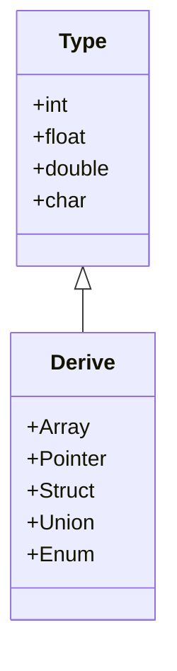

# 1-Séance 1 : Rappels et Approfondissements  
## 1-Rappels essentiels  
### 1-Types de données et opérateurs avancés en langage C  

---

## Introduction  
Le langage C, bien que simple dans ses fondations, offre une grande richesse via ses types de données et ses opérateurs avancés. Il est fondamental de bien maîtriser ces éléments pour écrire des programmes efficaces, sûrs et performants. Ce cours approfondit cette thématique en allant au-delà des bases en proposant une vision complète des types utilisés en C et de certains opérateurs avancés souvent sous-estimés.

---

## 1. Types de données en langage C  

### 1.1 Types de base  
- **int** : entier sur généralement 4 octets  
- **float** : nombre à virgule flottante simple précision  
- **double** : nombre à virgule flottante double précision  
- **char** : caractère, sur 1 octet, code ASCII  

### 1.2 Types dérivés et avancés  
- **Tableaux (Arrays)**  
  Séquence contiguë d’éléments du même type. Exemple :  
  ```c
  int tab[5] = {1, 2, 3, 4, 5};
  ```
- **Pointeurs**  
  Variable qui stocke l’adresse mémoire d’une autre variable. Cœur de la gestion mémoire en C. Exemple :  
  ```c
  int a = 10;
  int *ptr = &a;  // ptr pointe vers a
  ```
- **Structures (struct)**  
  Regroupement d’éléments hétérogènes sous un même type. Exemple :  
  ```c
  struct Point {
      int x;
      int y;
  };
  struct Point p1 = {10, 20};
  ```
- **Unions**  
  Permettent de stocker différentes données au même emplacement mémoire (mutuellement exclusives).  
- **Enums (énumérations)**  
  Types symboliques représentant des constantes entières nommées.  
  ```c
  enum Days {LUNDI, MARDI, MERCREDI};
  enum Days today = MARDI;
  ```

---

## 2. Opérateurs avancés en C  

### 2.1 Opérateurs d’adresse et de pointeur  
- **&** (opérateur « adresse de ») : récupère l’adresse d’une variable.  
- **\*** (déréférencement) : accède à la valeur pointée par un pointeur.  
Exemple d’usage combiné :  
```c
int a = 5;
int *p = &a;    // p stocke l'adresse de a
printf("%d\n", *p);  // affiche 5, la valeur pointée
```

### 2.2 Opérateurs bit à bit  
Manipulent les bits d’une valeur entière, utilisés en programmation bas niveau, optimisation et drivers.  
- **&** (ET bit à bit)  
- **|** (OU bit à bit)  
- **^** (OU exclusif bit à bit)  
- **~** (complément à un bit à bit)  
- **<<** (décalage à gauche)  
- **>>** (décalage à droite)  

Exemple :  
```c
unsigned char a = 5;        // binaire: 00000101
unsigned char b = a << 1;   // décalage à gauche (multiplication par 2) → 00001010 = 10
```

### 2.3 Opérateur ternaire  
Forme compacte d’un if-else qui retourne une valeur :  
```c
int y = (x > 0) ? 1 : -1;
```

### 2.4 Opérateurs d’incrémentation et décrémentation  
- **++** et **--** pour augmenter ou diminuer la valeur d’une variable de 1.  
- Position préfixe (++i) vs postfixe (i++) impacte l’ordre d’évaluation dans les expressions complexes.

### 2.5 Opérateurs de conversion de type (cast)  
Pour forcer la conversion d’un type en un autre. Exemple :  
```c
float f = 3.14;
int i = (int)f;  // i vaut 3
```

---

## 3. Exemples pour illustrer ces concepts  

```c
#include <stdio.h>

struct Coord {
    int x;
    int y;
};

int main() {
    int a = 10;
    int *p = &a;
    printf("Adresse de a : %p\n", (void*)p);
    printf("Valeur pointée : %d\n", *p);

    struct Coord pt = {5, 7};
    struct Coord *ppt = &pt;
    printf("Coordonnées : (%d, %d)\n", ppt->x, ppt->y);

    unsigned char val = 1 << 3; // décalage à gauche
    printf("1 << 3 = %d\n", val);

    int b = -10;
    int signe = (b >= 0) ? 1 : -1;
    printf("Signe de b : %d\n", signe);

    return 0;
}
```

---

## 4. Diagramme Mermaid illustrant les types de données en C  



---

## Sources utilisées  

- [Descriptif Programmation C 2024-2025 - Scribd](https://fr.scribd.com/document/805302074/Descriptif-Programmation-c-2024-2025)  
- [Langage C avancé - ENSTA (PDF)](https://perso.ensta-paris.fr/~pessaux/teaching/polys/IN102_MPI_allslides_no_solutions_24_25.pdf)  
- [Comprendre les types et opérateurs en C - Blog Alphorm](https://blog.alphorm.com/types-donnees-operateurs-langage-c)  
- C documentation et références traditionnelles (ISO C standards)

---

Ce cours a pour but de donner un cadre solide sur les types de données et opérateurs les plus utilisés et avancés en langage C, base indispensable pour aborder des sujets plus complexes liés à la gestion mémoire, aux algorithmes performants, et aux structures de données personnalisées.