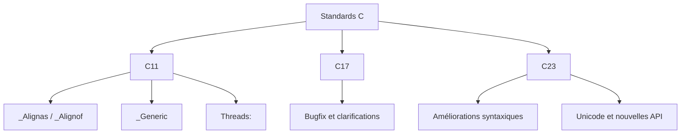

# 1-Séance 1 : Rappels et Approfondissements  
## 2-Les Standards C (C11, C17, C23)  
### 1-Évolution du langage C : principales nouveautés (alignement, `_Generic`, threads C11)  

---

## Introduction  
Depuis la publication originelle du standard C (C89/90), le langage C a continué d’évoluer avec plusieurs mises à jour majeures : C11, C17, et la plus récente C23. Ces standards ont introduit de nombreuses fonctionnalités nouvelles visant à améliorer la sécurité, la portabilité, la gestion de la concurrence, et la flexibilité du langage, tout en conservant sa simplicité et sa performance.

Nous allons détailler ici quelques-unes des nouveautés clés introduites en C11, approfondies en C17, et en cours d’adoption dans C23, notamment les attributs d’alignement, le mot-clé `_Generic` pour une forme de polymorphisme générique, ainsi que la bibliothèque standard pour la gestion des threads.

---

## 1. Évolution du langage C : rappel des standards récents  

| Standard | Année | Description courte                          |
|----------|--------|--------------------------------------------|
| C11      | 2011   | Ajout de la gestion des threads, `_Generic`, alignement mémoire avec `_Alignas` et `_Alignof`. |
| C17      | 2017   | Correction de bugs, clarifications, pas de nouveautés majeures. |
| C23      | à paraître / adoption progressive | Améliorations syntaxiques, fonctions supplémentaires, meilleur support Unicode, etc. |

---

## 2. Alignement mémoire (`_Alignas` et `_Alignof`)  

### 2.1 But de l’alignement  
L’alignement garantit qu’une variable est placée à une adresse mémoire multiple d’un certain nombre, ce qui peut améliorer les performances d’accès et éviter des défauts matériels.

### 2.2 Nouveau mot-clé `_Alignas`  
Permet de spécifier explicitement l’alignement d’une variable ou d’un type.  

### 2.3 Opérateur `_Alignof`  
Récupère l’alignement requis pour un type donné.  

### Exemple  
```c
#include <stdio.h>
#include <stdalign.h>  // depuis C11

struct S {
    char c;
    _Alignas(16) int x;
};

int main() {
    printf("Alignement de int : %zu\n", _Alignof(int));
    printf("Alignement de struct S : %zu\n", _Alignof(struct S));

    struct S s;
    printf("Adresse de s : %p\n", (void*)&s);
    printf("Adresse de s.x : %p\n", (void*)&s.x);
    return 0;
}
```

---

## 3. Le mot-clé `_Generic` : polymorphisme statique  

Introduit en C11, `_Generic` permet d’écrire des macros qui choisissent un comportement ou une fonction selon le type de l’argument, ce qui rapproche C d’un polymorphisme statique similaire à ce qu’on trouve en C++.

### Exemple d’utilisation  

```c
#include <stdio.h>

#define print_type(x) _Generic((x), \
    int: printf("int: %d\n", x), \
    float: printf("float: %f\n", x), \
    double: printf("double: %f\n", x), \
    default: printf("Type inconnu\n"))

int main() {
    print_type(3);
    print_type(3.14f);
    print_type(2.71828);
    print_type("texte");
    return 0;
}
```

Ce code choisit la bonne fonction `printf` en fonction du type de la variable passée.

---

## 4. Threads en C11 : prise en charge standard  

### 4.1 Bibliothèque `<threads.h>`  
C11 introduit une interface standardisée pour la création et la gestion de threads, synchronisation et autres primitives de concurrence. Elle est définie dans `<threads.h>`.

### 4.2 Fonctions principales  
- `thrd_create` : crée un nouveau thread.  
- `thrd_join` : attend la fin d’un thread.  
- `mtx_init`, `mtx_lock`, `mtx_unlock` : mutex.  
- `cnd_wait`, `cnd_signal` : variables condition.  

### Exemple de création simple d’un thread  

```c
#include <stdio.h>
#include <threads.h>

int thread_func(void *arg) {
    int *num = (int*)arg;
    printf("Hello from thread %d\n", *num);
    return 0;
}

int main() {
    thrd_t thread;
    int arg = 42;

    if (thrd_create(&thread, thread_func, &arg) != thrd_success) {
        printf("Erreur création thread\n");
        return 1;
    }

    thrd_join(thread, NULL);
    return 0;
}
```

---

## 5. Diagramme Mermaid résumé  



---

## 6. Sources utilisées  

- [Documents officiels ISO C - Standard C11](https://webstore.ansi.org/Standards/ISO/ISOIEC9899-2011)  
- [C11 Standard Library - cppreference](https://en.cppreference.com/w/c/thread)  
- [Understanding C11 Threads - IBM Developer](https://developer.ibm.com/articles/l-c11threads/)  
- [C11 _Generic explained - GeeksforGeeks](https://www.geeksforgeeks.org/generic-macros-c11-generic-selection/)  
- [C11 alignment - cppreference](https://en.cppreference.com/w/c/language/alignment)  
- [C23 draft and proposals - WG14](http://www.open-std.org/jtc1/sc22/wg14/www/docs/n3020.pdf)

---

Cette synthèse présente les principales évolutions modernes de C, offrant aux développeurs des outils pour écrire du code plus robuste, performant et adapté aux environnements concurrents.