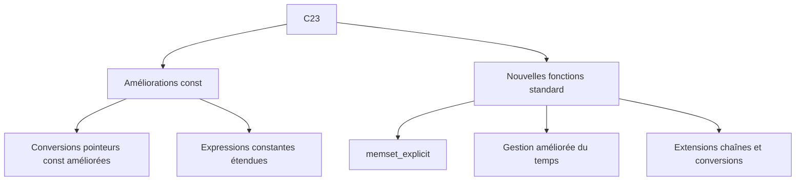

# 1-Séance 1 : Rappels et Approfondissements  
## 2-Les Standards C (C11, C17, C23)  
### 2-Améliorations du mot-clé `const` en C23 et nouvelles fonctions de bibliothèque  

---

## Introduction  
Avec la standardisation récente du C23, le langage C a intégré plusieurs améliorations visant à renforcer la sécurité, la lisibilité du code et à enrichir la bibliothèque standard. Parmi celles-ci, des évolutions notables concernent l’utilisation du qualificatif `const` ainsi que l’ajout de nouvelles fonctions pratiques dans la bibliothèque.

---

## 1. Améliorations autour de `const` dans C23  

### 1.1 Contexte et problème antérieur  
Le mot-clé `const` indique qu’une variable ne doit pas être modifiée après son initialisation, ce qui facilite la protection contre les modifications involontaires. Toutefois, avant C23, l’usage de `const` dans certains contextes (notamment avec les pointeurs composés ou lors de conversions) pouvait être limité ou source d’ambiguïtés.

### 1.2 Nouvelles règles de qualification `const`  
Le standard C23 introduit des règles plus souples et précises concernant la propagation de `const` et la conversion entre pointeurs qualifiés. Cela améliore la compatibilité entre les types et évite certaines erreurs de compilation inutiles. Ces règles permettent notamment :  
- D’avoir des conversions plus sûres entre pointeurs `const` imbriqués (par exemple `const int *` vers `const int * const *`).  
- Une meilleure prise en charge des expressions constantes dans des contextes plus variés.  

### 1.3 Exemple illustratif  

```c
const int a = 10;
const int *p1 = &a;
const int * const *p2 = &p1;  // Conversion désormais mieux supportée en C23
```

Avant C23, certains compilateurs pouvaient rejeter cette conversion stricte à cause d’une qualification `const` "trop profonde".  

---

## 2. Nouvelles fonctions dans la bibliothèque standard C23  

### 2.1 Fonctions d’aide à la manipulation mémoire  
- **`memset_explicit`** : version de `memset` garantie non optimisable, utile notamment pour effacer des zones sensibles (ex : clés cryptographiques) en évitant que le compilateur supprime ce nettoyage.  
  ```c
  void *memset_explicit(void *ptr, int value, size_t num);
  ```  

### 2.2 Fonctions temporelles  
- Ajout de nouvelles fonctions pour une meilleure gestion du temps, avec par exemple :  
  - `timespec_getres()` : récupérer la résolution d’un objet temporel.  
  - Extensions pour faciliter le travail avec `struct timespec`.  

### 2.3 Fonctions d’analyse de chaîne et conversion  
- Quelques ajouts qui simplifient le traitement de texte et conversions dans la bibliothèque `<string.h>` et `<stdlib.h>`.

### Exemple combiné d’utilisation de `memset_explicit`  

```c
#include <string.h>
#include <stdio.h>

int main() {
    char password[16] = "secretPass123";
    printf("Mot de passe avant nettoyage : %s\n", password);

    memset_explicit(password, 0, sizeof(password));  // Nettoyage mémoire garanti

    printf("Mot de passe après nettoyage : %s\n", password);  // Affiche chaîne vide
    return 0;
}
```

Cette fonction s’assure que le compilateur ne supprimera pas l’appel à memset, contrairement à `memset` classique dont l’appel pourrait être optimisé ou supprimé si la variable n’est plus utilisée ensuite.

---

## 3. Synthèse des nouveautés autour du `const` et de la bibliothèque  



---

## 4. Sources utilisées  

- [ISO/IEC 9899:2023 Draft](http://www.open-std.org/jtc1/sc22/wg14/www/docs/n3059.pdf) (brouillon C23)  
- [C23 new features - GitHub: gcc wiki](https://gcc.gnu.org/onlinedocs/gcc/C23.html)  
- [memset_explicit introduction - Microsoft Documentation](https://learn.microsoft.com/en-us/cpp/c-runtime-library/reference/memset-explicit-memset-secure?view=msvc-170)  
- [Exploring the new features of C23 - Embedded Artistry](https://embeddedartistry.com/blog/2023/03/15/new-c23-language-features/)  
- [Stack Overflow - Discussion sur const et C23](https://stackoverflow.com/questions/72672720/new-const-rules-in-c23)  

---

Cette section présente les avancées majeures introduites dans le standard C23 pour la gestion améliorée de `const` représentant une plus grande flexibilité et sécurité dans le typage, ainsi que les extensions fonctionnelles en bibliothèque qui facilitent le développement moderne.