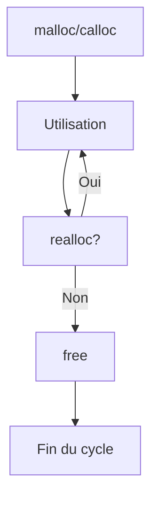

# 2-Séance 2 : Gestion Avancée de la Mémoire  
## 1-Allocation Dynamique (malloc, calloc, realloc, free)  
### 1-Rappels, erreurs courantes (fuites mémoire, double free)  

---

## Introduction  
La gestion dynamique de la mémoire est une composante centrale et délicate en langage C. Elle permet d’allouer et libérer la mémoire au moment de l’exécution (runtime), par opposition à la mémoire statique ou automatique. Pour cela, on utilise les fonctions standards `malloc`, `calloc`, `realloc` et `free`.  

Une mauvaise utilisation peut entraîner des problèmes classiques comme les fuites mémoire (mémoire non libérée), ou le double free (libération multiple d’un même bloc). Ce cours synthétise les principes essentiels pour éviter ces erreurs.

---

## 1. Principales fonctions d’allocation dynamique  

| Fonction   | Description                                                     | Particularités                                  |
|------------|-----------------------------------------------------------------|------------------------------------------------|
| `malloc`   | Alloue un bloc mémoire brut de taille indiquée (non initialisée). | Retourne un pointeur `void*` sur la mémoire allouée, ou `NULL` si échec. |
| `calloc`   | Alloue un bloc pour `n` éléments de taille `size` et initialise à 0. | Plus sûr si besoin d’un buffer initialisé à zéro. |
| `realloc`  | Redimensionne un bloc mémoire précédemment alloué.             | Peut déplacer le bloc, retourne un nouveau pointeur, `NULL` si échec. |
| `free`     | Libère un bloc mémoire précédemment alloué.                    | Ne supprime pas la variable, juste la mémoire. |

---

## 2. Utilisation et exemples  

### 2.1 `malloc` et `free`

```c
#include <stdio.h>
#include <stdlib.h>

int main() {
    int *tab = (int *)malloc(5 * sizeof(int));
    if (tab == NULL) {
        perror("malloc échoué");
        return 1;
    }
    for (int i = 0; i < 5; i++) {
        tab[i] = i * i;
        printf("%d ", tab[i]);
    }
    printf("\n");

    free(tab);
    return 0;
}
```

---

### 2.2 `calloc`  

```c
int *tab_zero = (int *)calloc(5, sizeof(int));
if (tab_zero == NULL) {
    perror("calloc échoué");
    return 1;
}
// tab_zero est initialisé à zéro
free(tab_zero);
```

---

### 2.3 `realloc`  

```c
int *tab_resize = (int *)malloc(3 * sizeof(int));
// initialisation
for (int i = 0; i < 3; i++) tab_resize[i] = i;
tab_resize = (int *)realloc(tab_resize, 6 * sizeof(int));
if (tab_resize == NULL) {
    perror("realloc échoué");
    // Attention éviter fuite mémoire si realloc échoue
}
// initialiser nouvelle zone
for (int i = 3; i < 6; i++) tab_resize[i] = i * 2;
free(tab_resize);
```

---

## 3. Erreurs courantes  

### 3.1 Fuites mémoire  
Oubli de `free` dans un programme de longue durée entraine une consommation excessive mémoire. Exemple :

```c
int *p = malloc(10 * sizeof(int));
// utilisation mais pas de free
```

### Remarque : un programme court qui termine libère généralement la mémoire, mais ce n’est pas une bonne pratique.

### 3.2 Double free  
Libération d’un même bloc plusieurs fois conduit à un comportement indéfini et souvent crash.

```c
int *p = malloc(10 * sizeof(int));
free(p);
// free(p); // ERREUR : double free
```

---

## 4. Diagramme Mermaid : cycle de vie d’un bloc mémoire  



---

## 5. Bonnes pratiques  

- Toujours vérifier le résultat de `malloc/calloc/realloc` (!= NULL) avant utilisation.  
- Initialiser la mémoire après allocation si nécessaire (sauf avec `calloc`).  
- Après `free(ptr)`, il est recommandé de faire `ptr = NULL` pour éviter un double free accidentel.  
- Éviter de réassigner directement le résultat de `realloc` à la même variable sans test préalable (perte potentielle du pointeur initial). Exemple sûr :  
  ```c
  int *tmp = realloc(ptr, new_size);
  if (tmp != NULL) {
    ptr = tmp;
  } else {
    // gestion erreur, ptr reste valide
  }
  ```
- Utiliser des outils de détection des fuites mémoire comme Valgrind ou AddressSanitizer.

---

## 6. Sources utilisées  

- [malloc, calloc, realloc, free - cppreference](https://en.cppreference.com/w/c/memory)  
- [Gestion mémoire en C - OpenClassrooms](https://openclassrooms.com/fr/courses/19980-apprenez-a-programmer-en-c/19871-dynamique-la-memoire)  
- [Common Memory Management Errors in C - GeeksforGeeks](https://www.geeksforgeeks.org/memory-leaks-and-memory-management-in-c/)  
- [Valgrind Documentation](http://valgrind.org/docs/manual/mc-manual.html)  

---

Ce cours rassemble les mécanismes fondamentaux de la gestion dynamique mémoire en C, ainsi que les erreurs typiques à éviter pour garantir la stabilité et l’efficacité des programmes.