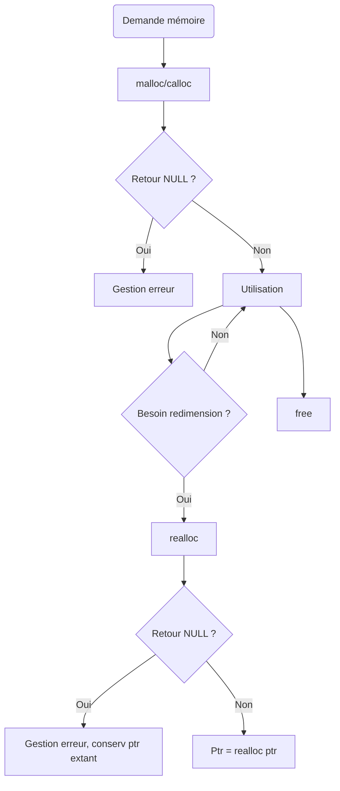

# 2-Séance 2 : Gestion Avancée de la Mémoire  
## 1-Allocation Dynamique (malloc, calloc, realloc, free)  
### 2-Stratégies d'allocation, vérification des retours d'allocation  

---

## Introduction  
L’allocation dynamique de mémoire est au cœur du développement en C pour gérer des données de taille variable ou inconnue à la compilation. Une gestion efficace nécessite non seulement d’utiliser correctement les fonctions d’allocation mais aussi d'adopter des stratégies robustes pour sécuriser le programme, notamment via la vérification systématique des retours d’allocation et des techniques adaptées pour limiter la fragmentation et optimiser la mémoire.

---

## 1. Stratégies d'allocation mémoire  

### 1.1 Allocation initiale et croissance  
Lorsqu'un programme a besoin d’une zone mémoire dont la taille peut évoluer, il est courant d’allouer une capacité initiale modérée, puis d’agrandir cette capacité via `realloc` selon les besoins.  

**Stratégie classique : doublement progressif**  
On commence par une taille initiale, puis à chaque saturation, on multiplie généralement la capacité par 2. Cela limite le nombre d’appels à `realloc` et donc les copies de données coûteuses.

### Exemple  
```c
size_t capacity = 4;
size_t size = 0;  // nombre d’éléments effectivement utilisés
int *array = malloc(capacity * sizeof(int));
if (array == NULL) {
    // gestion d’erreur
}
// Ajout d’éléments
for (int i = 0; i < 10; i++) {
    if (size == capacity) {
        size_t new_capacity = capacity * 2;
        int *tmp = realloc(array, new_capacity * sizeof(int));
        if (tmp == NULL) {
            // gestion d’erreur sans perdre le pointeur d’origine
            free(array);
            exit(EXIT_FAILURE);
        }
        array = tmp;
        capacity = new_capacity;
    }
    array[size++] = i;
}
```

Cette méthode évite une croissance linéaire coûteuse en reallocations répétées.

---

### 1.2 Allocation par blocs ou pools  
Pour des allocations répétées d’objets de taille fixe (ex : structures), créer un pool (zone mémoire préallouée) permet de diminuer la fragmentation et d’augmenter la rapidité. Cela est souvent utilisé dans des systèmes embarqués ou des moteurs de jeu.

---

## 2. Vérification obligatoire des retours d’allocation  

### 2.1 Pourquoi vérifier ?  
Un échec d’allocation se traduit par un retour de `NULL` (sur `malloc`, `calloc`, `realloc`). Sans contrôle, l’utilisation de ce pointeur NULL entraîne un comportement indéfini, potentiellement un plantage du programme.

### 2.2 Comment vérifier ?  

- Toujours tester que le pointeur retourné n’est pas `NULL` avant d’utiliser la mémoire.  
- En cas d’erreur, libérer les ressources et sortir proprement ou prévoir un plan de secours.

### Exemple simple  

```c
int *ptr = malloc(100 * sizeof(int));
if (ptr == NULL) {
    fprintf(stderr, "Erreur : allocation mémoire échouée\n");
    exit(EXIT_FAILURE);
}
// Utilisation de ptr
free(ptr);
```

---

### 2.3 Vérification spécialement pour `realloc`  

`realloc` peut retourner `NULL` tout en conservant le pointeur original valide. On ne doit pas écrire :

```c
ptr = realloc(ptr, new_size);  // RISQUE de fuite si realloc retourne NULL
```

Mais plutôt :

```c
int *tmp = realloc(ptr, new_size);
if (tmp == NULL) {
    // gestion d’erreur, ptr toujours valide
} else {
    ptr = tmp;
}
```

---

## 3. Diagramme Mermaid : Résumé des étapes d’allocation dynamique sécurisée  



---

## 4. Bonnes pratiques complémentaires  

- Initialiser les pointeurs alloués (avec `calloc` ou manuellement après malloc).  
- Libérer toujours la mémoire allouée pour éviter les fuites.  
- Documenter et centraliser la gestion mémoire si possible.  
- Utiliser des outils d’analyse dynamique (Valgrind, AddressSanitizer) pour détecter erreurs et fuites.

---

## 5. Sources  

- [Dynamic memory allocation in C - GeeksforGeeks](https://www.geeksforgeeks.org/dynamic-memory-allocation-in-c-using-malloc-calloc-free-and-realloc/)  
- [C malloc and realloc best practices - Stack Overflow](https://stackoverflow.com/questions/7704427/what-is-the-best-way-to-use-realloc-in-c)  
- [Memory Management in C - OpenClassrooms](https://openclassrooms.com/fr/courses/19980-apprenez-a-programmer-en-c/19871-dynamique-la-memoire)  
- [Valgrind documentation - Memcheck](http://valgrind.org/docs/manual/mc-manual.html)  

---

Ce cours expose des stratégies d’allocation efficaces et sécurisées, tout en insistant sur la nécessité de vérifier systématiquement les retours d’appel d’allocation mémoire pour garantir la robustesse des programmes en C.