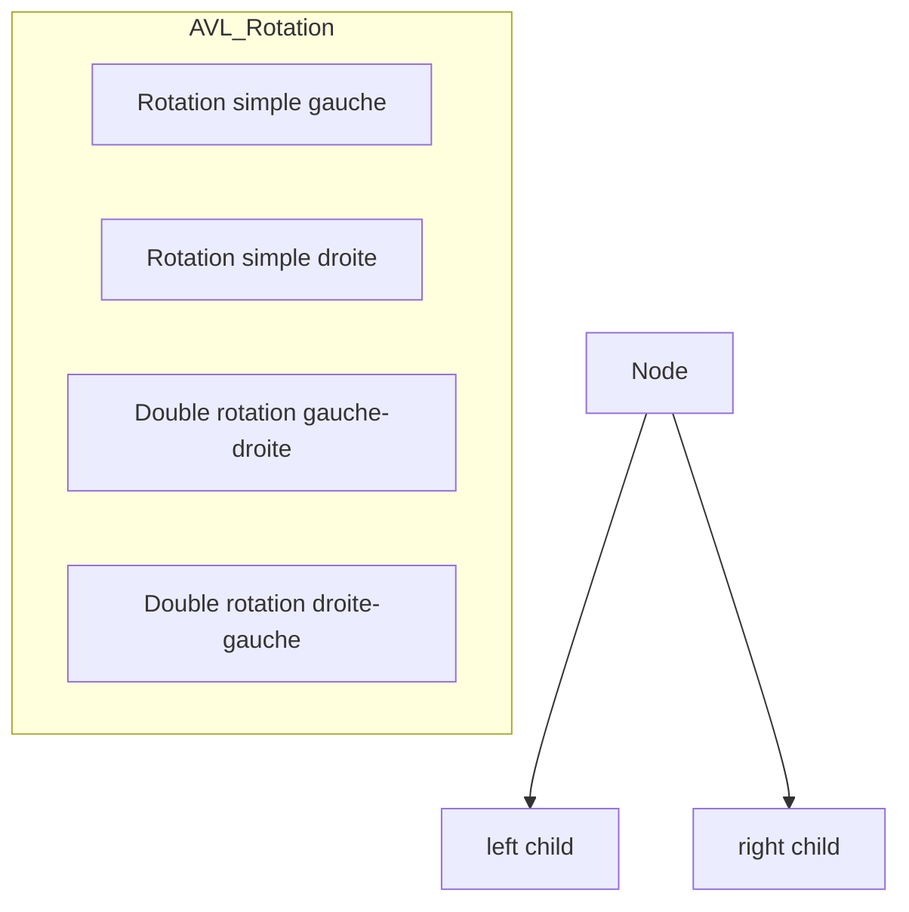

# 3-Séance 3 : Structures de Données Avancées  
## 2-Arbres et Graphes  
### 1-Arbres binaires de recherche, arbres équilibrés (concepts)  

---

## Introduction  
Les arbres binaires de recherche (ABR) permettent de stocker, rechercher, insérer et supprimer efficacement des données ordonnées. Pour garantir des performances optimales, notamment en recherchant un temps logarithmique, les arbres équilibrés ont été développés afin d’éviter la dégradation en liste chaînée.

---

## 1. Arbres Binaires de Recherche (ABR)  

### 1.1 Définition  
Un arbre binaire de recherche est un arbre binaire où chaque nœud satisfait la propriété suivante :  

- Tous les éléments du sous-arbre gauche sont inférieurs à la valeur du nœud.  
- Tous les éléments du sous-arbre droit sont supérieurs à la valeur du nœud.  

Cela permet des recherches efficaces via un parcours directionnel.

### 1.2 Structure et exemple de nœud  

```c
typedef struct Node {
    int key;
    struct Node *left;
    struct Node *right;
} Node;
```

### 1.3 Recherche dans un ABR  

```c
Node* rechercher(Node *root, int key) {
    if (root == NULL || root->key == key)
        return root;
    if (key < root->key)
        return rechercher(root->left, key);
    else
        return rechercher(root->right, key);
}
```

### 1.4 Insertion dans un ABR  

```c
Node* inserer(Node *root, int key) {
    if (root == NULL) {
        Node *node = malloc(sizeof(Node));
        node->key = key;
        node->left = node->right = NULL;
        return node;
    }
    if (key < root->key)
        root->left = inserer(root->left, key);
    else if (key > root->key)
        root->right = inserer(root->right, key);
    return root;
}
```

---

## 2. Arbres équilibrés  

### 2.1 Pourquoi équilibrer un arbre ?  
Un ABR classique peut devenir déséquilibré et ressembler à une liste chaînée (temps de recherche O(n)). Un arbre équilibré maintient la hauteur minimale possible (approximativement O(log n)) pour optimiser les opérations.

### 2.2 Principaux types d’arbres équilibrés  

- **Arbre AVL** : chaque nœud respecte la propriété d’équilibre que la différence de hauteur entre son sous-arbre gauche et droit ne dépasse pas 1. Des rotations sont effectuées pour rééquilibrer lors des insertions/suppressions.  
- **Arbre Rouge-Noir** : une version moins stricte et plus utilisée, les nœuds sont colorés en rouge ou noir selon des règles qui assurent un équilibre partiel mais suffisant.  

### 2.3 Propriétés AVL (extrait)  

- Facteur d’équilibre (FE) = hauteur sous-arbre gauche - hauteur sous-arbre droit  
- Pour chaque nœud, FE ∈ {-1, 0, 1}

Des rotations (simples et doubles) sont utilisées pour corriger les déséquilibres.

---

## 3. Diagramme Mermaid : Structure d’un ABR et cas de rotations AVL  



---

## 4. Notes sur la complexité  

| Opération     | ABR non équilibré | Arbres équilibrés (AVL, Rouge-Noir) |
|---------------|------------------|------------------------------------|
| Recherche     | O(n)             | O(log n)                           |
| Insertion     | O(n)             | O(log n)                           |
| Suppression   | O(n)             | O(log n)                           |

---

## 5. Sources utilisées  

- [Binary Search Tree - GeeksforGeeks](https://www.geeksforgeeks.org/binary-search-tree-data-structure/)  
- [AVL Tree - Programiz](https://www.programiz.com/dsa/avl-tree)  
- [Red Black Tree - GeeksforGeeks](https://www.geeksforgeeks.org/red-black-tree-set-1-introduction-2/)  
- [Introduction to Algorithms (Cormen et al.) - Chapitre sur arbres équilibrés]  
- [Wikipedia - Binary Search Tree](https://en.wikipedia.org/wiki/Binary_search_tree)  
- [Wikipedia - AVL Tree](https://en.wikipedia.org/wiki/AVL_tree)  

---

### Synthèse  
Les arbres binaires de recherche fournissent un moyen ordonné et efficace pour manipuler des ensembles dynamiques de données. L’équilibrage automatique (AVL, rouge-noir) permet de garantir la performance même dans le pire cas, grâce à des rotations et règles spécifiques maintenant la structure équilibrée.