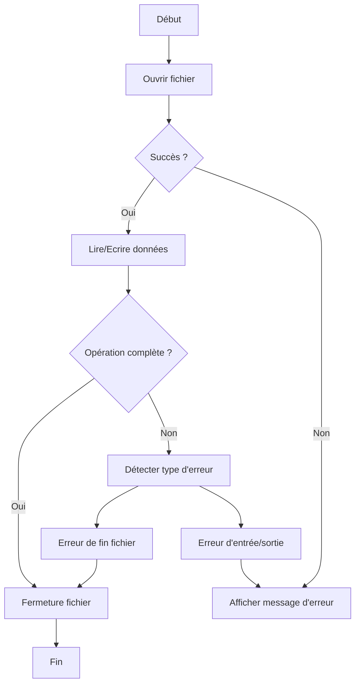

# 4-Séance 4 : Manipulation de Fichiers et Entrées/Sorties Avancées  
## 1-Fichiers Texte et Binaire  
### 2-Gestion des erreurs lors des opérations sur les fichiers  

---

## Introduction  
Les opérations sur fichiers en C (ouverture, lecture, écriture, fermeture) peuvent échouer pour diverses raisons : fichier inexistant, permissions insuffisantes, disque plein, erreur d’E/S, etc. Une bonne gestion des erreurs est indispensable afin d’éviter les comportements imprévisibles et permettre un diagnostic précis.

---

## 1. Vérification du résultat de `fopen`  

La première étape consiste à contrôler que le fichier s'est bien ouvert.

```c
FILE *file = fopen("data.txt", "r");
if (file == NULL) {
    perror("Erreur ouverture fichier");
    return EXIT_FAILURE;
}
```

- `fopen` retourne `NULL` si l'ouverture échoue.  
- La fonction `perror` affiche un message d’erreur associé à la variable globale `errno`.  

---

## 2. Gestion d’erreurs avec `fread` et `fwrite`  

Ces fonctions retournent le nombre d’éléments effectivement lus ou écrits. Si ce nombre est inférieur à l’attendu, une erreur ou fin de fichier a pu se produire.

```c
size_t n = fread(buffer, sizeof(char), taille, file);
if (n < taille) {
    if (feof(file))
        printf("Fin de fichier atteinte\n");
    else if (ferror(file)) {
        perror("Erreur lors de la lecture");
    }
}
```

- `feof(FILE*)` détecte la fin de fichier.  
- `ferror(FILE*)` indique une erreur d’E/S.

---

## 3. Contrôle des erreurs lors de l’écriture  

De même, pour `fwrite` :

```c
size_t n = fwrite(buffer, sizeof(char), taille, file);
if (n < taille) {
    perror("Erreur lors de l’écriture");
}
```

---

## 4. Utilisation de `clearerr`  

Pour réinitialiser les indicateurs d’erreur et de fin de fichier :

```c
clearerr(file);
```

---

## 5. Gestion des erreurs avec `fseek` et `ftell`  

```c
if (fseek(file, 0, SEEK_SET) != 0) {
    perror("Erreur lors du déplacement dans le fichier");
}

long pos = ftell(file);
if (pos == -1L) {
    perror("Erreur lors de la consultation de la position");
}
```

---

## 6. Exemples de flux classique avec gestion d’erreur  

```c
FILE *file = fopen("data.txt", "r");
if (!file) {
    perror("Ouverture");
    return EXIT_FAILURE;
}

char buffer[128];
while (fgets(buffer, sizeof(buffer), file) != NULL) {
    printf("%s", buffer);
}

if (ferror(file)) {
    perror("Erreur de lecture");
}
fclose(file);
```

---

## 7. Diagramme Mermaid : Cycle de gestion d’erreur dans les opérations fichier  



---

## 8. Bonnes pratiques  

- Toujours tester la valeur de retour des fonctions.  
- Utiliser `perror` ou `strerror(errno)` pour afficher les messages d’erreur compréhensibles.  
- Gérer la fin de fichier distinctement des erreurs d’E/S.  
- Fermer le fichier même en cas d’erreur pour libérer les ressources.  

---

## 9. Sources utilisées  

- [Error Handling in C File I/O - GeeksforGeeks](https://www.geeksforgeeks.org/error-handling-in-file-handling-in-c/)  
- [FILE * - GNU C Library](https://www.gnu.org/software/libc/manual/html_node/Opening-Streams.html)  
- [fread, fwrite, fseek, ftell - cppreference](https://en.cppreference.com/w/c/io)  
- [C error handling - POSIX standards](https://pubs.opengroup.org/onlinepubs/9699919799/functions/fread.html)  
- [perror function - Linux man pages](https://linux.die.net/man/3/perror)  

---

Ce contenu clarifie les mécanismes standards pour détecter, signaler et gérer les erreurs lors des opérations sur fichiers, offrant une maîtrise nécessaire pour produire du code robuste en entrée/sortie.