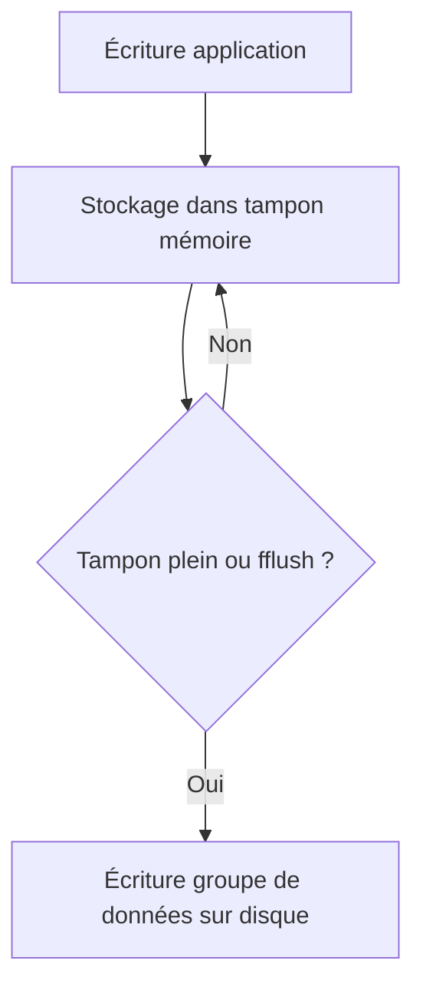

# 4-Séance 4 : Manipulation de Fichiers et Entrées/Sorties Avancées  
## 2-Entrées/Sorties Bufférisées et Non Bufférisées  
### 1-Compréhension des tampons (buffers) et de leur impact  

---

## Introduction  
Les entrées/sorties (I/O) en C peuvent être **bufférisées** ou **non bufférisées**. La plupart des fonctions de la bibliothèque standard utilisent des tampons mémoire (buffers) pour optimiser les performances en réduisant le nombre d’accès directs au matériel ou au système de fichiers. Comprendre le rôle des tampons est fondamental pour écrire du code efficace et éviter certains comportements inattendus.

---

## 1. Qu’est-ce qu’un tampon (buffer) ?  

Un tampon est une zone mémoire temporaire où les données sont stockées avant d’être lues ou écrites physiquement.  

- **E/S bufférisée** : les données sont d’abord copiées dans/le tampon, puis transférées en un bloc.  
- **E/S non bufférisée** : chaque opération est immédiatement exécutée au niveau matériel (lecture ou écriture).

### But principal  
Réduire le nombre d’appels systèmes coûteux en regroupant plusieurs petites opérations en une seule grande.

---

## 2. Tampon dans les fichiers C  

La bibliothèque standard `stdio.h` utilise un tampon pour les flux `FILE*` :  

- Lors d’une **écriture**, les données sont stockées dans un tampon en mémoire puis écrites sur le disque lorsque le tampon est plein, lors d’un `fflush` ou lors d’une fermeture de fichier.  
- Lors d’une **lecture**, un bloc de données est lu dans le tampon, puis fourni au programme petit à petit.  

---

## 3. Modes de buffering  

Trois modes selon la configuration du flux :  

| Mode             | Description                                | Exemples typiques            |
|------------------|--------------------------------------------|-----------------------------|
| **Buffered (plein)**    | Buffer en mémoire, écrit/lit par blocs. | Fichiers sur disque          |  
| **Line buffered**  | Buffer vidé à chaque retour à la ligne    | Sortie standard, consoles    |  
| **Unbuffered**     | Pas de buffer, chaque opération est immédiate| Erreur standard, flux critiques |

---

## 4. Exemple d’impact du buffering  

```c
#include <stdio.h>

int main() {
    printf("Début");
    sleep(5);  // Pause 5 secondes
    printf(" Fin\n");
    return 0;
}
```

- On ne voit pas le premier texte "Début" tout de suite car il est en tampon.  
- Il est affiché lorsqu’un `\n` est rencontré ou lors d’un `fflush(stdout)`.

---

## 5. Forcer la vidange du tampon  

- Avec `fflush(FILE *stream)` on vide explicitement le tampon d’écriture.  

```c
printf("Début");
fflush(stdout);
sleep(5);
printf(" Fin\n");
```

Maintenant "Début" s’affichera immédiatement.

---

## 6. I/O Non bufférisée  

Exemple en bas niveau avec `write` sous POSIX (en-tête `<unistd.h>`) :  

```c
#include <unistd.h>
write(STDOUT_FILENO, "Début", 5); 
sleep(5);
write(STDOUT_FILENO, " Fin\n", 5);
```

Chaque écriture est directe, donc immédiate, sans retard lié au buffer.

---

## 7. Diagramme Mermaid : cycle d’écriture avec tampon  



---

## 8. Conséquences à connaître  

- Les tampons améliorent les performances mais peuvent retarder l’affichage ou l’écriture réelle des données.  
- Les programmes interactifs doivent souvent forcer la vidange (`fflush`) pour que les messages apparaissent immédiatement.  
- En cas de plantage, des données présentes dans le tampon peuvent être perdues si elles n’ont pas été vidées.  

---

## 9. Sources utilisées  

- [Buffering - cppreference](https://en.cppreference.com/w/c/io/buffering)  
- [stdio buffering - GNU C Library](https://www.gnu.org/software/libc/manual/html_node/Buffered-I_002fO.html)  
- [How I/O buffering works - GNU Libc manual](https://www.gnu.org/software/libc/manual/html_node/Streams-and-Buffering.html)  
- [fflush - POSIX specification](https://pubs.opengroup.org/onlinepubs/9699919799/functions/fflush.html)  
- [Difference between buffered and unbuffered I/O - Stack Overflow](https://stackoverflow.com/questions/12258433/difference-between-buffered-and-non-buffered-i-o)  

---

Ce module clarifie la nature des tampons dans les entrées/sorties en C, leur influence sur le comportement des programmes, et comment les contrôler pour garantir un bon équilibre entre performance et réactivité.