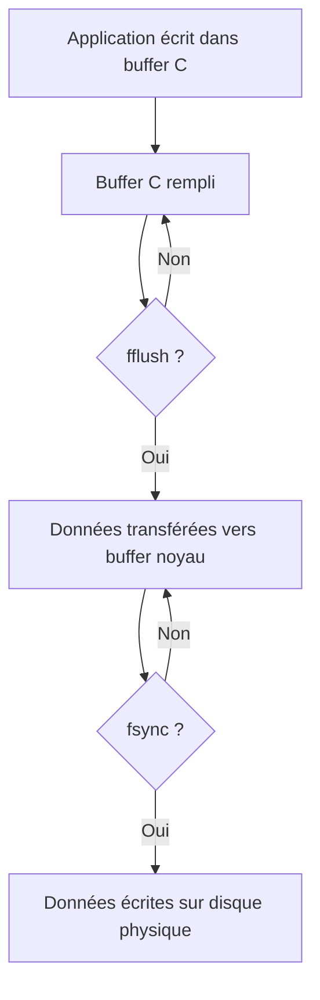

# 4-Séance 4 : Manipulation de Fichiers et Entrées/Sorties Avancées  
## 2-Entrées/Sorties Bufférisées et Non Bufférisées  
### 2-Fonctions `setbuf`, `fflush`, `fsync` (concepts)  

---

## Introduction  
En C, les opérations d’Entrées/Sorties (E/S) utilisent un tampon (buffer) pour optimiser les performances. Contrôler le comportement du buffer est possible grâce aux fonctions `setbuf` et `fflush`. Par ailleurs, `fsync` permet de garantir la synchronisation des données avec le support de stockage physique, indépendamment du buffering logiciel.  

---

## 1. Fonction `setbuf` : configuration du buffer d’un flux  

### 1.1 Description  
`setbuf` permet d’associer ou dissocier un tampon mémoire pour un flux `FILE*`.  

### 1.2 Prototype  

```c
void setbuf(FILE *stream, char *buf);
```

- `stream` : flux (ex. `stdout`, fichier ouvert).  
- `buf` : pointeur vers buffer utilisateur de taille `BUFSIZ`, ou `NULL` pour désactiver le buffering (mode non bufférisé).  

### 1.3 Effets  

- Si `buf` != `NULL`, le flux est bufferisé dans ce tampon.  
- Si `buf` == `NULL`, le flux devient non bufferisé (opérations immédiates).  

### 1.4 Exemple  

```c
char buffer[BUFSIZ];
setbuf(stdout, buffer);  // associer buffer personnalisé à stdout

// ou pour désactiver  
setbuf(stdout, NULL);
```

---

## 2. Fonction `fflush` : forcer la vidange du buffer  

### 2.1 Description  
`fflush` force l’écriture immédiate des données encore en mémoire tampon vers le fichier ou flux associé.  

### 2.2 Prototype  

```c
int fflush(FILE *stream);
```

- Si `stream` == `NULL`, `fflush` agit sur tous les flux ouverts en écriture.  

### 2.3 Retour  
- `0` en cas de succès.  
- `EOF` en cas d’erreur.  

### 2.4 Exemple  

```c
printf("Message immédiat");
fflush(stdout);  // on vide le tampon de stdout pour affichage immédiat
```

---

## 3. Fonction `fsync` : synchronisation disque au niveau système  

### 3.1 Description  
`fsync` est une fonction POSIX qui force la synchronisation des données d’un fichier ouvert depuis le buffer du noyau vers le disque physique. Elle intervient **après** la gestion du tampon par la bibliothèque C, agissant sur le système d’exploitation.  

### 3.2 Prototype  

```c
int fsync(int fd);
```

- `fd` : descripteur de fichier obtenu avec `fileno(FILE*)`.  

### 3.3 Utilité  
Assurer que les données sont écrites physiquement sur le support (important pour la durabilité et la récupération).  

### 3.4 Exemple  

```c
FILE *file = fopen("data.txt", "w");
fprintf(file, "Données critiques\n");
fflush(file);
fsync(fileno(file));
fclose(file);
```

---

## 4. Différences et complémentarités  

| Fonction | Type de Buffering         | Objectif                              | Niveau       |
|----------|--------------------------|-------------------------------------|--------------|
| `setbuf` | Buffer bibliothèque C    | Configurer/désactiver le buffer     | Application  |
| `fflush` | Buffer bibliothèque C    | Forcer la vidange du buffer          | Application  |
| `fsync`  | Buffer système d’exploitation | Synchroniser les données sur disque | Système      |

---

## 5. Diagramme Mermaid : interaction entre buffer, `fflush` et `fsync`  



---

## 6. Points importants  

- `setbuf` doit être appelé **avant** la première opération I/O sur le flux.  
- `fflush` garantit l’écriture dans le buffer du noyau mais pas forcément sur disque.  
- `fsync` garantit la persistance des données sur support physique.  
- En absence de `fflush`, `fsync` ne synchronisera pas nécessairement toutes données (buffer C non vidé).  
- Ces fonctions sont essentielles dans les contextes où la perte de données est critique (systèmes embarqués, bases de données).  

---

## 7. Sources utilisées  

- [setbuf - C Standard Library - cppreference](https://en.cppreference.com/w/c/io/setbuf)  
- [fflush - C Standard Library - cppreference](https://en.cppreference.com/w/c/io/fflush)  
- [fsync - POSIX - man7.org](https://man7.org/linux/man-pages/man2/fsync.2.html)  
- [Buffering - GNU Libc manual](https://www.gnu.org/software/libc/manual/html_node/Streams-and-Buffering.html)  
- [Buffering explained - Stack Overflow](https://stackoverflow.com/questions/12258433/difference-between-buffered-and-non-buffered-i-o)  

---

Ce cours clarifie les fonctions principales pour contrôler les tampons en entrée/sortie C et expliquer la différence entre buffering logiciel et synchronisation physique, composants essentiels pour la gestion fiable et performante des fichiers.