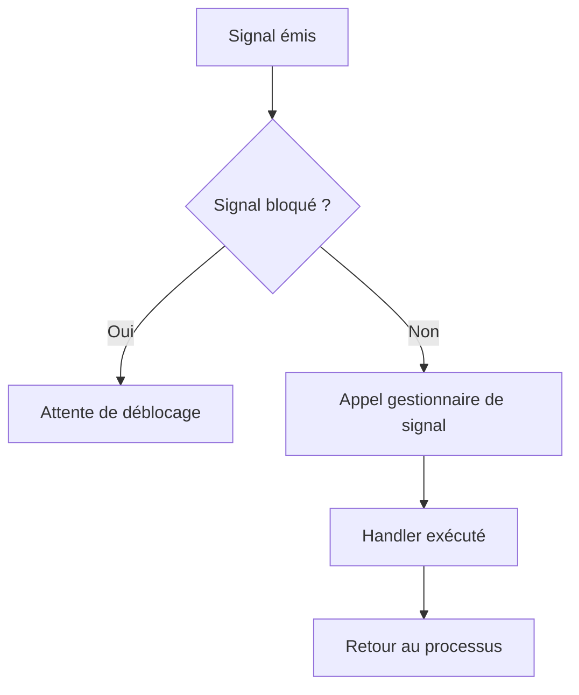

# 5-Séance 5 : Programmation Système et Multitâche  
## 1-Appels Système de Base  
### 2-Concepts de gestion des signaux  

---

## Introduction  
Les signaux sont un mécanisme d’interruption asynchrone dans les systèmes UNIX/Linux permettant de notifier un processus d’un événement ou d’une condition particulière (exemple : interruption clavier, fin d’un fils, erreur critique). La gestion des signaux repose sur plusieurs concepts fondamentaux : identification, action par défaut, gestion personnalisée via handlers, et masquage.

---

## 1. Qu’est-ce qu’un signal ?  

Un **signal** est une notification envoyée à un processus ou un groupe de processus pour interrompre son déroulement normal et déclencher une action particulière.  

### Signaux standard courants  

| Signal   | Description                    |
|----------|-------------------------------|
| `SIGINT` | Interruption clavier (Ctrl+C) |
| `SIGTERM`| Demande d'arrêt               |
| `SIGKILL`| Arrêt forcé (irrécupérable)  |
| `SIGCHLD`| Fin d’un processus fils       |
| `SIGALRM`| Alarme temporisée             |

---

## 2. Actions des signaux  

Un signal peut entraîner :  

- **Action par défaut** (exemple, terminer le processus)  
- **Ignoré**  
- **Traitement personnalisé** via une fonction appelée *handler* (gestionnaire de signal)

---

## 3. Installer un gestionnaire de signal (`signal` et `sigaction`)  

### 3.1 Fonction `signal`  

```c
#include <signal.h>

void (*signal(int sig, void (*handler)(int)))(int);
```

- Permet d’assigner un `handler` pour le signal `sig`.  
- `handler` est une fonction prenant un int (le signal reçu).  
- Exemple d’utilisation simple :  

```c
#include <stdio.h>
#include <signal.h>

void handler_SIGINT(int sig) {
    printf("Signal SIGINT reçu (%d)\n", sig);
}

int main() {
    signal(SIGINT, handler_SIGINT);
    while(1);
    return 0;
}
```

### 3.2 Fonction `sigaction` (recommandée)  

Remplace `signal` pour plus de contrôle (masquage temporaire de signaux, comportements portables).  

```c
#include <signal.h>

struct sigaction sa;
sa.sa_handler = handler_SIGINT;
sigemptyset(&sa.sa_mask);
sa.sa_flags = 0;
sigaction(SIGINT, &sa, NULL);
```

---

## 4. Masquage et blocage des signaux  

- `sigprocmask` permet de bloquer certains signaux afin d’éviter leur traitement pendant une section critique.  
- Le masque est un ensemble de signaux bloqués temporairement.  

---

## 5. Gestion des signaux en multitâche  

- Les signaux peuvent réveiller des processus en attente (`pause()`, `sigsuspend()`).  
- `SIGCHLD` est souvent utilisé pour notifier la fin d’un fils, afin que le parent fasse un `wait()` et évite les processus zombies.  

---

## 6. Exemple complet d’attente du signal `SIGCHLD` pour récupérer un fils  

```c
#include <stdio.h>
#include <stdlib.h>
#include <unistd.h>
#include <signal.h>
#include <sys/wait.h>

void handler_SIGCHLD(int sig) {
    int status;
    pid_t pid = wait(&status);
    printf("Fils terminé, PID=%d, status=%d\n", pid, status);
}

int main() {
    signal(SIGCHLD, handler_SIGCHLD);

    pid_t pid = fork();
    if (pid == 0) {
        // fils
        printf("Processus fils lancé\n");
        sleep(2);
        exit(42);
    } else {
        // parent
        printf("Processus parent attend ...\n");
        while(1) pause(); // attente signal
    }
    return 0;
}
```

---

## 7. Diagramme Mermaid : cycle de traitement d’un signal  



---

## 8. Points importants  

- `SIGKILL` et `SIGSTOP` ne peuvent pas être capturés ni ignorés.  
- Les handlers doivent éviter les fonctions non réentrantes (exemple, éviter `printf` dans un handler en contexte critique).  
- Utiliser `sigaction` plutôt que `signal` pour garantir portabilité et contrôle.  
- La gestion correcte des signaux évite les processus zombies et améliore la robustesse des applications multitâches.  

---

## 9. Sources utilisées  

- [signal(7) — Linux manual page](https://man7.org/linux/man-pages/man7/signal.7.html)  
- [sigaction - Linux man page](https://man7.org/linux/man-pages/man2/sigaction.2.html)  
- [Advanced Programming in the UNIX Environment - Stevens, Rago]  
- [The Linux Programming Interface - Kerrisk]  
- [POSIX Signal Concepts - The Open Group](https://pubs.opengroup.org/onlinepubs/9699919799/functions/signal.html)

---

Ce cours détaille les mécanismes fondamentaux des signaux dans les systèmes UNIX, leurs traitements, la configuration des gestionnaires et les bonnes pratiques liées à leur gestion.