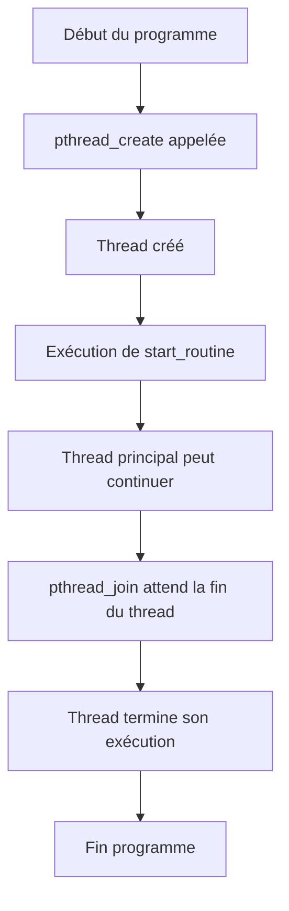

# 5-Séance 5 : Programmation Système et Multitâche  
## 2-Introduction aux Threads (Pthreads C11)  
### 1-Création de threads avec `pthread_create`  

---

## Introduction  
Les threads permettent d'exécuter plusieurs séquences d'instructions concouramment au sein d'un même processus, partageant la mémoire. La bibliothèque POSIX Threads (Pthreads) est l'interface standard sous Unix/Linux pour la programmation multithreadée. La fonction `pthread_create` est essentielle : elle lance un nouveau thread d’exécution.

---

## 1. Qu’est-ce qu’un thread ?  

- Un **thread** est une unité d’exécution plus légère qu’un processus.  
- Partage le même espace mémoire que les autres threads du processus.  
- Permet un parallélisme coopératif ou préemptif efficace.  

---

## 2. Fonction `pthread_create` : création d’un thread  

### 2.1 Prototype  

```c
#include <pthread.h>

int pthread_create(pthread_t *thread, const pthread_attr_t *attr,
                   void *(*start_routine)(void *), void *arg);
```

- `thread` : pointeur vers variable de type `pthread_t` où sera stocké l'identifiant du thread créé.  
- `attr` : paramétrage optionnel du thread (peut être `NULL` pour valeurs par défaut).  
- `start_routine` : fonction exécutée par le thread (doit retourner `void *` et prendre un `void *` en paramètre).  
- `arg` : argument passé à la fonction `start_routine`.  

### 2.2 Retour :  
- `0` en cas de succès.  
- Code d'erreur sinon.  

---

## 3. Exemple simple de création et attente de thread  

```c
#include <stdio.h>
#include <pthread.h>
#include <stdlib.h>

void *thread_function(void *arg) {
    int id = *((int *)arg);
    printf("Thread %d lancé\n", id);
    return NULL;
}

int main() {
    pthread_t thread;
    int id = 1;

    if(pthread_create(&thread, NULL, thread_function, &id) != 0) {
        perror("Erreur pthread_create");
        return EXIT_FAILURE;
    }

    // Attendre la fin du thread
    pthread_join(thread, NULL);

    printf("Thread terminé\n");

    return EXIT_SUCCESS;
}
```

---

## 4. Explications clés  

- La fonction `start_routine` est l’entrée du thread, un point de départ d'exécution.  
- L’argument `arg` permet de passer des données (un pointeur) au thread.  
- `pthread_join` permet de synchroniser : attendre la fin d’un thread.  

---

## 5. Attention : gestion des arguments  

- Il faut s’assurer que l’argument passé reste valide tant que le thread l’utilise.  
- Dans l’exemple ci-dessus, la variable `id` est locale mais vivante pendant la durée du thread puisque `pthread_join` bloque la sortie du `main` jusqu’à la fin.  

---

## 6. Diagramme Mermaid : cycle de vie de création d’un thread  



---

## 7. Bonnes pratiques  

- Toujours vérifier le code retour de `pthread_create`.  
- Protéger l’accès aux ressources partagées (mutex, sémaphores).  
- Ne pas retourner de pointeur vers des variables locales depuis `start_routine`.  
- Utiliser `pthread_exit` pour terminer proprement un thread si besoin.  

---

## 8. Sources utilisées  

- [pthread_create on man7.org](https://man7.org/linux/man-pages/man3/pthread_create.3.html)  
- [POSIX Threads Programming - IEEE Std](https://pubs.opengroup.org/onlinepubs/9699919799/functions/pthread_create.html)  
- [Thread basics - cppreference](https://en.cppreference.com/w/c/thread)  
- [Beej’s Guide to Pthreads](https://beej.us/guide/bgnet/html/#pthreads)  

---

Ce cours aborde la création basique de threads avec `pthread_create`, en explicitant les mécanismes d’appel et de synchronisation, essentiels pour initier la programmation multitâche efficace sous UNIX/Linux.