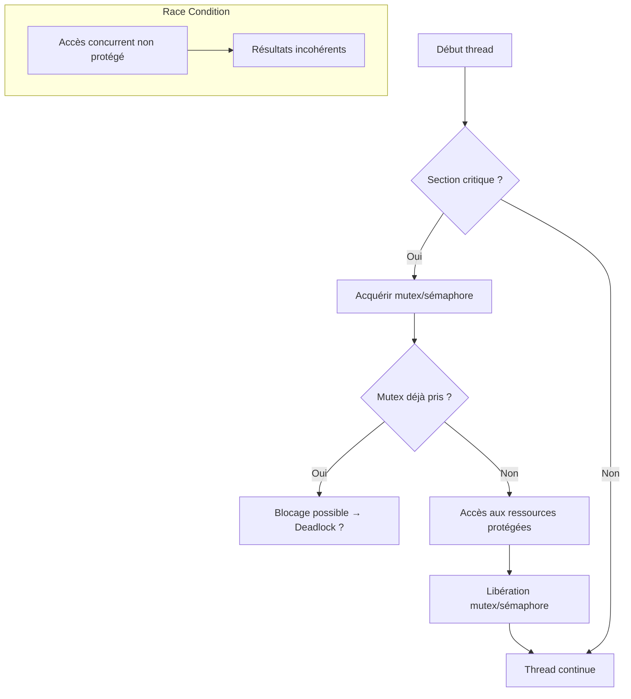

# 5-Séance 5 : Programmation Système et Multitâche  
## 2-Introduction aux Threads (Pthreads C11)  
### 2-Synchronisation des threads (mutex, sémaphore), problèmes courants (deadlock, race condition)  

---

## Introduction  
Les threads exécutant simultanément un programme partagent les ressources mémoire. Cette concurrence génère des problèmes d’accès concurrent, notamment des **race conditions** (conditions de course) et **deadlocks** (interblocages). La synchronisation via **mutex** et **sémaphores** aide à garantir un accès sûr aux ressources partagées.

---

## 1. Problèmes courants liés à la concurrence  

### 1.1 Race condition (condition de course)  
Quand plusieurs threads accèdent et modifient simultanément une même donnée sans synchronisation, le résultat peut être incohérent, imprévisible.

**Exemple concret** : compteur partagé incrémenté par plusieurs threads sans protection, pouvant engendrer des valeurs erratiques.  

---

### 1.2 Deadlock (interblocage)  
Situation où deux ou plusieurs threads se bloquent mutuellement en attendant indéfiniment la libération d ресурсы détenues l’un par l’autre.

---

## 2. Mutex : exclusion mutuelle  

### 2.1 Description  
Un **mutex** est un verrou binaire qui protège une section critique, garantissant qu’un seul thread à la fois peut y accéder.  

### 2.2 Interface de base  

```c
#include <pthread.h>

pthread_mutex_t mutex = PTHREAD_MUTEX_INITIALIZER;

pthread_mutex_lock(&mutex);   // Verrouillage (attente si déjà verrouillé)
pthread_mutex_unlock(&mutex); // Déverrouillage
```

---

### 2.3 Exemple simple  

```c
#include <stdio.h>
#include <pthread.h>

int compteur = 0;
pthread_mutex_t verrou = PTHREAD_MUTEX_INITIALIZER;

void* incrementer(void* arg) {
    for (int i = 0; i < 100000; i++) {
        pthread_mutex_lock(&verrou);
        compteur++;
        pthread_mutex_unlock(&verrou);
    }
    return NULL;
}

int main() {
    pthread_t t1, t2;
    pthread_create(&t1, NULL, incrementer, NULL);
    pthread_create(&t2, NULL, incrementer, NULL);

    pthread_join(t1, NULL);
    pthread_join(t2, NULL);

    printf("Compteur final = %d\n", compteur); // Devrait être 200000
    return 0;
}
```

---

## 3. Sémaphore : contrôle d’accès avec compteur  

### 3.1 Description  
Un **sémaphore** gère un compteur, permettant à un certain nombre de threads d’entrer simultanément dans une section critique.  

### 3.2 Interface POSIX  

```c
#include <semaphore.h>

sem_t sem;
sem_init(&sem, 0, 1); // initialisé à 1, fonctionne comme mutex

sem_wait(&sem);  // Attente (P operation)
sem_post(&sem);  // Libération (V operation)
```

---

### 3.3 Exemple simple avec sémaphore  

```c
#include <stdio.h>
#include <pthread.h>
#include <semaphore.h>

int compteur = 0;
sem_t sem;

void* incrementer(void* arg) {
    for (int i=0; i<100000; i++) {
        sem_wait(&sem);
        compteur++;
        sem_post(&sem);
    }
    return NULL;
}

int main() {
    pthread_t t1, t2;
    sem_init(&sem, 0, 1);

    pthread_create(&t1, NULL, incrementer, NULL);
    pthread_create(&t2, NULL, incrementer, NULL);

    pthread_join(t1, NULL);
    pthread_join(t2, NULL);

    printf("Compteur final = %d\n", compteur);
    sem_destroy(&sem);
    return 0;
}
```

---

## 4. Deadlock : pourquoi et comment éviter ?  

### 4.1 Mécanisme  
Le deadlock se produit souvent lorsque plusieurs threads essaient d’acquérir plusieurs mutex dans un ordre différent, provoquant une attente circulaire.

### 4.2 Conditions classiques du deadlock (Coffman)  
- Exclusion mutuelle  
- Attente non préemptive  
- Attente circulaire  
- Ressources détenues bloquant l’un l’autre  

### 4.3 Prévention pratique  
- Acquisition des mutex dans un ordre global cohérent.  
- Utilisation de `pthread_mutex_trylock` pour éviter blocage définitif.  
- Conception de flux simplifiant la gestion des ressources.  

---

## 5. Diagramme Mermaid : interaction mutex, sémaphore, risques deadlock, race condition  



---

## 6. Points clés  

- **Mutex** : protection simple pour exclusion mutuelle, adapté aux sections critiques uniques.  
- **Sémaphore** : utile pour contrôler l’accès à un nombre limité de ressources.  
- La maîtrise des **deadlocks** passe par une gestion rigoureuse de l’ordre d’acquisition et des timeouts.  
- Tester et analyser les applications multithread pour identifier les **race conditions** est une étape essentielle du développement.  

---

## 7. Sources utilisées  

- [pthread_mutex_lock - Linux man page](https://man7.org/linux/man-pages/man3/pthread_mutex_lock.3.html)  
- [sem_wait - Linux man page](https://man7.org/linux/man-pages/man3/sem_wait.3.html)  
- [Deadlock - Wikipedia](https://en.wikipedia.org/wiki/Deadlock)  
- [Race condition - Wikipedia](https://en.wikipedia.org/wiki/Race_condition)  
- [Advanced Programming in the UNIX Environment - Stevens, Rago]  
- [The Linux Programming Interface - Kerrisk]  

---

La synchronisation par mutex et sémaphore est un outil incontournable pour éviter les erreurs dues à l’accès concurrent aux ressources partagées. Comprendre et gérer les problèmes classiques comme deadlock et race condition permet d’écrire des programmes multitâches robustes et prévisibles.