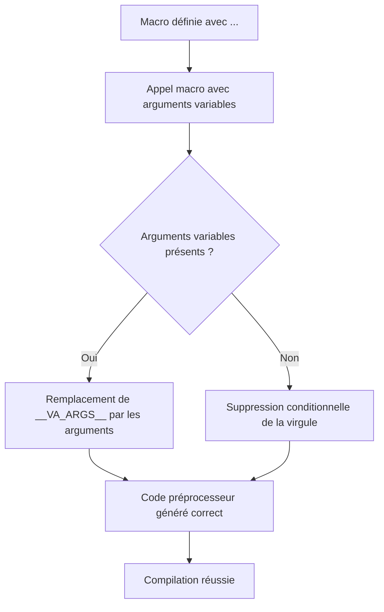

# 6-Séance 6 : Préprocesseur Avancé et Macros  
## 1-Macros Avancées  
### 1-Macros avec arguments variables (`__VA_ARGS__`)  

---

## Introduction  
Le préprocesseur C permet d’utiliser des macros avec un nombre d’arguments variable grâce à la construction spéciale `__VA_ARGS__`. Cela offre une grande flexibilité pour écrire des macros génériques, particulièrement utiles pour le débogage, le logging ou les fonctions wrappers.

---

## 1. Principe des macros à arguments variables  

En standards C99 et suivants, on peut définir une macro avec un nombre indéfini d’arguments par :  

```c
#define NomMacro(arg_fixe, ...)
```

Le paramètre `...` représente des arguments variables, accessibles via `__VA_ARGS__` dans le corps de la macro.

---

## 2. Syntaxe de base  

```c
#define LOG(fmt, ...) printf(fmt, __VA_ARGS__)
```

Ici, la macro `LOG` permet de remplacer des appels `printf` avec un format et un nombre variable d’arguments.

---

## 3. Exemple concret : macro `LOG` avec arguments variables  

```c
#include <stdio.h>

#define LOG(fmt, ...) printf("[LOG] " fmt "\n", __VA_ARGS__)

int main() {
    LOG("Valeur = %d", 42);
    LOG("Test sans argument variable");
    return 0;
}
```

**Attention** :  
Dans cet exemple, la deuxième invocation génèrera une erreur car `__VA_ARGS__` est vide.  

---

## 4. Gestion de cas sans argument variable dans `__VA_ARGS__`  

Pour éviter les erreurs lorsqu’aucun argument variable n’est passé, plusieurs techniques existent.

### 4.1. Utilisation de `##__VA_ARGS__` spécifique à GCC/clang  

```c
#define LOG(fmt, ...) printf("[LOG] " fmt "\n", ##__VA_ARGS__)
```

Le préprocesseur supprime la virgule si `__VA_ARGS__` est vide, ce qui permet de faire  

```c
LOG("Test sans argument variable");
```

sans erreur.  

### 4.2. Macro avec argument fixe seul (C99 strict)  

Une autre possibilité est d’utiliser une macro surchargeant l’appel selon le nombre d’arguments (plus complexe).

---

## 5. Exemple amélioré avec suppression de la virgule  

```c
#include <stdio.h>

#define LOG(fmt, ...) printf("[LOG] " fmt "\n", ##__VA_ARGS__)

int main() {
    LOG("Valeur = %d", 42);
    LOG("Test sans argument variable");
    return 0;
}
```

Ici, la macro fonctionne quelle que soit la présence d’arguments variables.

---

## 6. Applications avancées  

- Macros de debug et trace personnalisées  
- Macros de génération de code répétitif avec paramétrage flexible  
- Adaptation de fonctions wrappers modulaires  

---

## 7. Diagramme Mermaid : fonctionnement d’une macro à argument variable  



---

## 8. Points importants  

- `__VA_ARGS__` nécessite un compilateur compatible C99 ou supérieur.  
- La syntaxe `##__VA_ARGS__` est une extension (généralement supportée sur GCC/Clang) pour gérer le cas avec absence d’arguments variables.  
- Évitez d’utiliser `__VA_ARGS__` dans des macros complexes sans test, pour ne pas provoquer d’erreurs de syntaxe.  
- Le préprocesseur ne fait pas de vérification des types, soyez prudent lors du passage d’arguments.  

---

## 9. Sources utilisées  

- [Variadic Macros - cppreference](https://en.cppreference.com/w/c/preprocessor/replace)  
- [GCC Variadic Macros](https://gcc.gnu.org/onlinedocs/cpp/Variadic-Macros.html)  
- [Stack Overflow - How to omit the comma in __VA_ARGS__ if empty?](https://stackoverflow.com/questions/5588855/standard-alternative-to-gccs-va-args-trick)  
- [ISO C99 Standard](https://www.open-std.org/jtc1/sc22/wg14/www/docs/n1256.pdf)  
- [The C Preprocessor in Depth - RW AS](https://jhnet.co.uk/articles/cpp_magic)  

---

Les macros variadiques offrent une puissante abstraction au préprocesseur C, permettant une écriture concise et flexible, tout en nécessitant une certaine prudence pour éviter les pièges syntaxiques liés à la gestion des arguments optionnels.