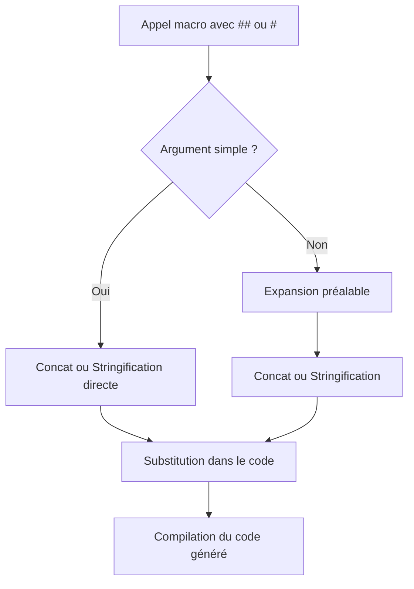

# 6-Séance 6 : Préprocesseur Avancé et Macros  
## 1-Macros Avancées  
### 2-Concaténation de tokens (`##`), stringification (`#`)  

---

## Introduction  
Le préprocesseur C propose des opérateurs spéciaux pour manipuler les identificateurs et les chaînes dans les macros : la **concaténation de tokens** à l’aide de `##` et la **stringification** avec `#`. Ces opérateurs permettent une métaprogrammation puissante, générant du code flexible et dynamique.

---

## 1. Concaténation de tokens (`##`)  

### 1.1 Principe  
L'opérateur `##` fusionne (concatène) deux tokens en un seul lors du remplacement macro. Ce mécanisme est utile pour générer des noms de variables, fonctions, ou autres identificateurs de manière automatique.  

### 1.2 Syntaxe  

```c
#define CONCAT(a, b) a ## b
```

### 1.3 Exemple simple  

```c
#include <stdio.h>

#define CONCAT(a, b) a ## b

int main() {
    int xy = 42;
    printf("%d\n", CONCAT(x, y)); // équivalent à printf("%d\n", xy);
    return 0;
}
```

Ici, `CONCAT(x, y)` devient `xy`, ce qui accède à la variable `xy`.

---

## 2. Stringification des arguments (`#`)  

### 2.1 Principe  
L’opérateur `#` transforme un argument macro en une chaîne de caractères (string literal). Cela sert à générer des messages, du code d’impression ou des noms convertis en chaîne.

### 2.2 Syntaxe  

```c
#define STRINGIFY(x) #x
```

### 2.3 Exemple simple  

```c
#include <stdio.h>

#define STRINGIFY(x) #x

int main() {
    printf("Le texte : %s\n", STRINGIFY(Hello World)); // affiche: Le texte : Hello World
    return 0;
}
```

Le texte `Hello World` est converti en chaîne `"Hello World"` dans la macro.

---

## 3. Exemple combiné avec concaténation et stringification  

```c
#include <stdio.h>

#define MAKE_VAR(name, num) name ## num
#define TO_STRING(x) #x

int main() {
    int MAKE_VAR(var, 1) = 10;               // crée variable var1
    printf("Value of %s = %d\n", TO_STRING(var1), var1);
    return 0;
}
```

Sortie :  
```
Value of var1 = 10
```

---

## 4. Utilité en programmation avancée  

- Générer automatiquement des noms de fonctions ou variables (ex : `func_debug`, `func_release`).  
- Automatiser la création de structures et d’identifiants  
- Produire des messages de débogage intégrant du code source (nom, valeur).  
- Créer des macros plus polyvalentes sans répétition manuelle.  

---

## 5. Attention aux limites  

- La concaténation fusionne les tokens littéralement, il faut veiller à ce que le résultat soit un identificateur valide.  
- Le stringification ne fait pas d’évaluation, il transforme l’argument brut en chaîne.  
- L’expansion correcte lors de la concaténation ou stringification peut nécessiter des macros intermédiaires.  

---

## 6. Exemple avec macro intermédiaire pour expansion  

```c
#define STR_HELPER(x) #x
#define STR(x) STR_HELPER(x)

#define CONCAT_HELPER(a, b) a ## b
#define CONCAT(a, b) CONCAT_HELPER(a, b)

#define VERSION 2

int main() {
    printf("Version : %s\n", STR(VERSION)); // affiche "VERSION"
    printf("Version expandue : %s\n", STR_HELPER(VERSION)); // affiche "VERSION"
    printf("Version corrigée : %s\n", STR(VERSION)); // affiche "2"

    int CONCAT(var, VERSION) = 5;
    printf("Valeur de var2 = %d\n", var2);
    return 0;
}
```

---

## 7. Diagramme Mermaid : flux d'expansion avec concaténation et stringification  



---

## 8. Sources utilisées  

- [C Preprocessor - gcc.gnu.org](https://gcc.gnu.org/onlinedocs/cpp/Concatenation.html)  
- [Stringification and Token Pasting - cppreference](https://en.cppreference.com/w/c/preprocessor/replace)  
- [The C Preprocessor in Depth - J. Handy](https://jhnet.co.uk/articles/cpp_magic)  
- [ISO C Standard n1256 (chapitre 6.10.3)](https://www.open-std.org/jtc1/sc22/wg14/www/docs/n1256.pdf)  
- [Stack Overflow : Differences between # and ##](https://stackoverflow.com/questions/3745224/what-is-the-difference-between-and-in-c-macros)  

---

La concaténation et la stringification dans les macros C fournissent un véritable métalangage pour manipuler le code à la compilation, facilitant l’écriture d’outils génériques, de code auto-généré et d’améliorations robustes dans les programmes complexes.