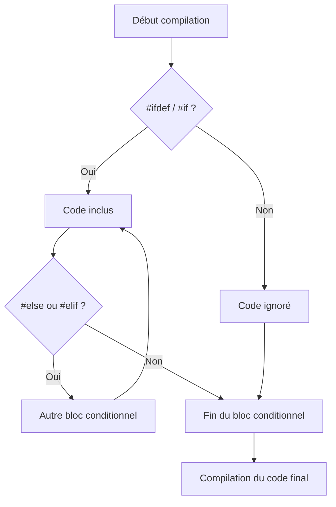

# 6-Séance 6 : Préprocesseur Avancé et Macros  
## 2-Inclusions Conditionnelles et Attributs (C23)  
### 1-Utilisation de `#if`, `#ifdef`, `#ifndef`, `#error`, `#pragma`  

---

## Introduction  
Le préprocesseur C permet d’adapter la compilation en fonction de conditions définies par des macros, de contrôler les inclusions et d’utiliser des directives spécifiques pour ajuster le comportement du compilateur. Les directives conditionnelles `#if`, `#ifdef`, `#ifndef` et de contrôle comme `#error` ou `#pragma` sont des outils essentiels pour écrire du code portable, sûr et maintenable.

---

## 1. Directive `#if`  

Permet d’évaluer une expression entière au moment de la compilation et d’inclure ou d’exclure du code selon son résultat.  

```c
#if EXPRESSION
    // Code inclus si EXPRESSION évaluée à non nul
#else
    // Code sinon
#endif
```

### Exemple  

```c
#define VERSION 2

#if VERSION >= 2
    // Code pour version 2 ou plus
#else
    // Version antérieure
#endif
```

---

## 2. Directive `#ifdef` et `#ifndef`  

- `#ifdef MACRO` : inclut le code si la macro est définie.  
- `#ifndef MACRO` : inclut le code si la macro n’est pas définie.  

### Exemples  

```c
#ifdef DEBUG
    printf("Mode debug activé\n");
#endif

#ifndef RELEASE
    // Code pour non-release
#endif
```

---

## 3. Directive `#error`  

Génère une erreur de compilation avec un message personnalisé. Utile pour imposer des prérequis ou interdire certaines configurations.  

```c
#ifndef MIN_VERSION
#error "MIN_VERSION doit être défini"
#endif
```

---

## 4. Directive `#pragma`  

Directive spécifique au compilateur servant à donner des ordres spéciaux. Elle varie selon les compilateurs, mais la norme C23 introduit des attributs standards via `#pragma`.  

Exemples courants :  

- **GCC / Clang** :  
```c
#pragma once       // Inclusion unique du fichier  
#pragma GCC poison strcpy  // interdiction d’utiliser strcpy
```

- **Standard C23** introduit des directives pragmas normalisées pour l’attribut `assume`, etc., permettant au compilateur d’appliquer des optimisations.

---

## 5. Exemple complet combinant directives  

```c
#include <stdio.h>

#define VERSION 1

#ifndef FEATURE_ENABLED
#error "FEATURE_ENABLED doit être défini"
#endif

#if VERSION >= 2
void new_feature() {
    printf("Nouvelle fonctionnalité activée\n");
}
#else
void old_feature() {
    printf("Ancienne fonctionnalité\n");
}
#endif

int main() {
#ifdef FEATURE_ENABLED
#if VERSION >= 2
    new_feature();
#else
    old_feature();
#endif
#else
    printf("Feature désactivée\n");
#endif
    return 0;
}
```

---

## 6. Diagramme Mermaid : flux de compilation conditionnelle  



---

## 7. Notes et recommandations  

- Toujours vérifier la présence des macros critiques avec `#ifndef` + `#error` pour améliorer la robustesse.  
- Utiliser `#pragma once` plutôt que les gardes d’inclusion classiques pour éviter la double inclusion (supporté par la plupart des compilateurs modernes).  
- Les directives `#pragma` étant spécifiques au compilateur, leur portabilité est limitée ; vérifier la documentation du compilateur ciblé.  
- La nouvelle norme C23 apporte des normes sur certains pragmas, ce qui devrait améliorer la portabilité.  

---

## 8. Sources utilisées  

- [cppreference - Preprocessor directives](https://en.cppreference.com/w/c/preprocessor)  
- [GCC Preprocessor - Pragmas](https://gcc.gnu.org/onlinedocs/cpp/Pragmas.html)  
- [C23 draft standard - WG14](https://open-std.org/jtc1/sc22/wg14/www/docs/n3047.pdf)  
- [Microsoft Docs - #pragma (C/C++)](https://learn.microsoft.com/en-us/cpp/preprocessor/pragma-directives-and-the-pragma-keyword)  
- [Stack Overflow - Using #error](https://stackoverflow.com/questions/9482373/usage-of-error-in-c-preprocessor)  

---

## Conclusion  
Les inclusions conditionnelles et directives telles que `#error` et `#pragma` permettent de contrôler finement la génération du code et la gestion des configurations, renforçant la portabilité et la sécurité des programmes en C. Leur usage adapté facilite la maintenance et augmente la qualité du code produit.