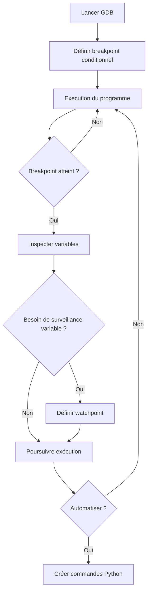

# 7-Séance 7 : Debugging, Profiling et Optimisation  
## 1-Outils de Débogage  
### 1-Utilisation avancée de GDB (breakpoints conditionnels, watchpoints, commandes Python)  

---

## Introduction  
Le débogueur GDB est un outil puissant pour analyser et corriger les programmes en C. Pour gagner en efficacité lors du diagnostic, il est possible d’utiliser des fonctionnalités avancées telles que les **breakpoints conditionnels**, les **watchpoints** et l’intégration de scripts **Python** pour automatiser et étendre le débogage.

---

## 1. Breakpoints conditionnels  

### 1.1 Principe  
Un breakpoint conditionnel suspend l’exécution uniquement quand une condition spécifiée est vraie, permettant d’ignorer des itérations inutiles ou d’autres situations non pertinentes.

### 1.2 Syntaxe  

```gdb
break <fonction|ligne> if <condition>
```

### 1.3 Exemple  

```gdb
(gdb) break my_function if x == 42
```

Ici, l’exécution s'arrêtera dans `my_function` seulement si la variable `x` vaut 42.

---

## 2. Watchpoints  

### 2.1 Principe  
Surveille un emplacement mémoire (variable ou expression), et interrompt l’exécution lorsque cette valeur change (read or write selon type).

### 2.2 Commandes  

- `watch <expression>` : s’arrête à chaque modification de `<expression>`.  
- `rwatch <expression>` : s’arrête quand l’expression est lue.  
- `awatch <expression>` : s’arrête quand l’expression est lue ou écrite.  

### 2.3 Exemple  

```gdb
(gdb) watch compteur
```

L’exécution se bloque dès que `compteur` est modifié.

---

## 3. Commandes Python dans GDB  

### 3.1 Utilités  
GDB embarque un interpréteur Python, permettant :  

- D’écrire des commandes personnalisées.  
- D’automatiser des tâches répétitives.  
- D’étendre le débogueur (analyse spécifique au programme, affichage personnalisé).  

### 3.2 Exemple simple : définir une commande Python  

```gdb
(gdb) python
> class Hello(gdb.Command):
>    def __init__(self):
>        super(Hello, self).__init__("hello", gdb.COMMAND_USER)
>    def invoke(self, arg, from_tty):
>        print("Hello from Python in GDB! Arg:", arg)
> Hello()
> end
```

Puis en GDB :  

```gdb
(gdb) hello world
Hello from Python in GDB! Arg: world
```

### 3.3 Exemple avancé : affichage personnalisé d’une structure  

```gdb
python
class PointPrinter:
    "Affiche de manière formatée un point (x,y)."
    def __init__(self):
        gdb.pretty_printers.append(self)
    def __call__(self, val):
        type_str = str(val.type)
        if type_str == "struct Point":
            return self
    def to_string(self):
        point = self.val
        return "Point(%d, %d)" % (point['x'], point['y'])

PointPrinter()
end
```

---

## 4. Résumé des commandes utiles  

| Commande GDB           | Description                                   |
|-----------------------|-----------------------------------------------|
| `break <loc> if <cond>`| Point d'arrêt conditionnel                     |
| `watch <var>`          | Surveillance écriture sur variable             |
| `rwatch <var>`         | Surveillance lecture sur variable              |
| `awatch <var>`         | Surveillance lecture/écriture sur variable     |
| `python ... end`       | Définir commandes/logiciel via scripts Python  |

---

## 5. Diagramme Mermaid : cycle d’analyse avec GDB avancé  



---

## 6. Sources utilisées  

- [GDB Documentation - Breakpoints](https://sourceware.org/gdb/current/onlinedocs/gdb/Breakpoints.html)  
- [GDB Documentation - Watchpoints](https://sourceware.org/gdb/current/onlinedocs/gdb/Watchpoints.html)  
- [GDB Python API](https://sourceware.org/gdb/current/onlinedocs/gdb/Python-API.html)  
- [Tutorialspoint - GDB Watchpoints](https://www.tutorialspoint.com/gnu_debugger/debugger_watchpoints.htm)  
- [Embedded Artistry - Python scripting in GDB](https://embeddedartistry.com/blog/2017/07/12/python-and-gdb/)  

---

L’exploitation avancée des breakpoints conditionnels, watchpoints et commandes Python dans GDB permet d’affiner le processus de débogage, réduisant le temps d’identification des anomalies et augmentant la précision d’observation des comportements internes du programme.