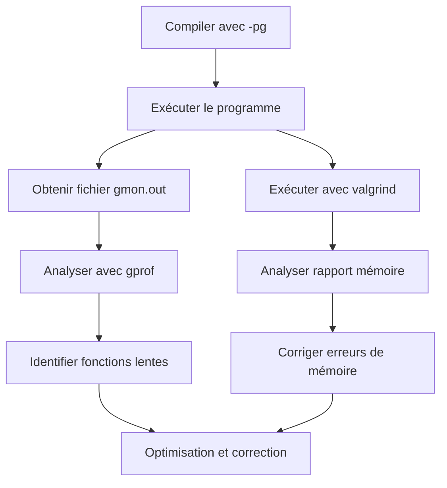

# 7-Séance 7 : Debugging, Profiling et Optimisation  
## 2-Profiling et Optimisation  
### 1-Introduction à `gprof` et `valgrind` (détection de fuites mémoire)  

---

## Introduction  
Pour améliorer les performances et la fiabilité des programmes, il est nécessaire d’analyser leur comportement en temps d'exécution. Deux outils largement utilisés dans le domaine sont **gprof**, pour le profilage CPU, et **valgrind**, pour la détection notamment des fuites mémoire.

---

## 1. `gprof` : Profilage de performances  

### 1.1 Fonctionnement  
`gprof` est un profileur qui analyse les performances de code compilé avec l’option `-pg`. Il mesure :  
- le temps d’exécution par fonction,  
- le nombre d’appels à chaque fonction,  
- la hiérarchie d’appels (call graph).  

### 1.2 Compilation et exécution  

```bash
gcc -pg -o mon_programme mon_programme.c
./mon_programme
```

Cette exécution produit un fichier `gmon.out` contenant les données de profilage.

### 1.3 Analyse  

```bash
gprof mon_programme gmon.out > rapport.txt
```

`rapport.txt` contient :  
- Statistiques par fonction (temps passé, pourcentage).  
- Liste des appels et appelants (call graph).

### 1.4 Exemple simple  

Code `exemple.c` :  

```c
#include <stdio.h>

void fonction_lente() {
    for (volatile long i = 0; i < 100000000; i++);
}

int main() {
    fonction_lente();
    return 0;
}
```

Pour analyser :  

```bash
gcc -pg -o exemple exemple.c
./exemple
gprof exemple gmon.out > profil.txt
less profil.txt
```

---

## 2. `valgrind` : Détection des erreurs mémoire et fuites  

### 2.1 Fonctionnement  
Valgrind exécute un programme en instrumentant son accès mémoire pour détecter :  
- Fuites mémoire non libérées,  
- Utilisations de mémoire non initialisée,  
- Accès hors limites,  
- Double libération,  
- Etc.

### 2.2 Commande de base  

```bash
valgrind --leak-check=full ./mon_programme
```

L’option `--leak-check=full` affiche les détails des fuites mémoire avec pile d’appel.

### 2.3 Exemple  

```c
#include <stdlib.h>

int main() {
    int *ptr = malloc(sizeof(int) * 10);
    // oublie de free ptr
    return 0;
}
```

Analyse avec Valgrind :  

```bash
valgrind --leak-check=full ./mon_programme
```

=> Rapport indiquant la fuite mémoire avec localisation dans le code.

---

## 3. Complémentarité entre `gprof` et `valgrind`  

| Outil    | Usage principal                      | Points forts                       |
|----------|------------------------------------|----------------------------------|
| `gprof`  | Profilage CPU                      | Visualisation temps et appels    |
| `valgrind`| Analyse mémoire (fuites, erreurs) | Détection précise et pile d’appel|

---

## 4. Diagramme Mermaid : Processus d’analyse avec gprof et valgrind  



---

## 5. Bonnes pratiques  

- Toujours profiler un programme compilé avec `-pg` pour garantir la validité des résultats.  
- Utiliser Valgrind dès que vous soupçonnez des problèmes de mémoire, notamment pour les programmes longs ou avec allocation dynamique intensive.  
- Coupler les résultats des deux outils pour optimiser efficacement : corriger les erreurs mémoire puis améliorer les performances.  
- Garder à l'esprit que la précision dépend du compilateur, de l’architecture et de la charge système durant l’exécution.  

---

## 6. Sources utilisées  

- [GNU gprof Manual](https://sourceware.org/binutils/docs/gprof/)  
- [Valgrind Official Documentation](http://valgrind.org/docs/manual/manual.html)  
- [Tutorialspoint - gprof](https://www.tutorialspoint.com/gprof/index.htm)  
- [Tutorialspoint - Valgrind](https://www.tutorialspoint.com/valgrind/index.htm)  
- [Stack Overflow - When to use gprof vs valgrind](https://stackoverflow.com/questions/5408943/when-to-use-gprof-vs-valgrind)  

---

Le tandem de gprof et valgrind constitue une base complémentaire puissante pour diagnostiquer la performance et la qualité mémoire d’un programme C, facilitant ainsi la correction ciblée et l’optimisation effective du code.