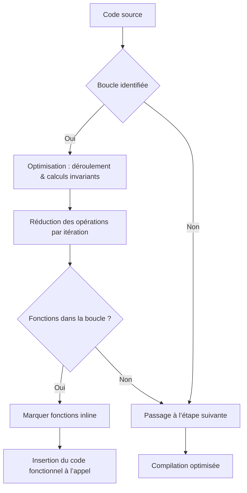

# 7-Séance 7 : Debugging, Profiling et Optimisation  
## 2-Profiling et Optimisation  
### 2-Techniques d'optimisation : boucles et fonctions inline  

---

## Introduction  
L'optimisation du code C repose souvent sur des techniques ciblant les structures de contrôle et la gestion des fonctions. L'optimisation des **boucles** et l'utilisation de **fonctions inline** permettent d'améliorer l'efficacité du programme sans compromettre sa clarté.

---

## 1. Optimisation des boucles  

### 1.1 Importance  
Les boucles représentent souvent les portions les plus exécutées d’un programme. Les optimiser peut significativement réduire le temps d'exécution.

### 1.2 Techniques courantes  

#### a) Déroulement (loop unrolling)  

Consiste à répéter explicitement l’intérieur d'une boucle plusieurs fois pour réduire le nombre d’itérations et les coûts liés au test de la condition et au saut.

**Exemple :**

Avant :

```c
for (int i=0; i<8; i++) {
    array[i] *= 2;
}
```

Après déroulement par 4 :  

```c
for (int i=0; i<8; i+=4) {
    array[i] *= 2;
    array[i+1] *= 2;
    array[i+2] *= 2;
    array[i+3] *= 2;
}
```

Réduit le nombre de vérifications de condition de boucle.

#### b) Minimisation des calculs internes  

Factoriser les calculs invariants hors de la boucle.

```c
// Moins efficace
for (int i=0; i<n; i++) {
    int val = expensive_computation();
    process(array[i], val);
}

// Plus efficace
int val = expensive_computation();
for (int i=0; i<n; i++) {
    process(array[i], val);
}
```

#### c) Accès mémoire optimisé  

Favoriser l'accès séquentiel mémoire pour profiter du cache.

---

## 2. Fonctions `inline`  

### 2.1 Principe  
Une fonction `inline` demande au compilateur d’insérer directement le corps de la fonction à l’endroit de son appel, évitant ainsi le coût d’appel (push/pop pile, saut).  

### 2.2 Syntaxe  

```c
inline int add(int a, int b) {
    return a + b;
}
```

### 2.3 Avantages  

- Réduction du temps d'appel de fonction.  
- Facilite l’optimisation par le compilateur.  

### 2.4 Limitations et bonnes pratiques  

- Ne pas abuser avec des fonctions volumineuses pour éviter d’augmenter excessivement la taille du code (code bloat), ce qui peut dégrader la cache instruction.  
- Dans certains contextes, le compilateur peut ignorer `inline` si l’optimisation n’est pas bénéfique.

---

## 3. Exemple combiné  

```c
#include <stdio.h>

inline int square(int x) {
    return x * x;
}

int main() {
    int array[8] = {1,2,3,4,5,6,7,8};
    int sum = 0;

    // Déroulement manuelle avec fonction inline
    for (int i=0; i<8; i+=4) {
        sum += square(array[i]);
        sum += square(array[i+1]);
        sum += square(array[i+2]);
        sum += square(array[i+3]);
    }
    printf("Sum of squares = %d\n", sum);
    return 0;
}
```

---

## 4. Diagramme Mermaid : interaction entre optimisation de boucles et fonctions inline  



---

## 5. Sources utilisées  

- [GCC Inline Functions](https://gcc.gnu.org/onlinedocs/gcc/Inline.html)  
- [LLVM Loop Optimization Passes](https://llvm.org/docs/Passes.html#loop-optimization-passes)  
- [The Art of Loop Optimization](https://www.agner.org/optimize/optimizing_cpp.pdf)  
- [ISO C11 Standard — Inline Functions](https://port70.net/~nsz/c/c11/n1570.html#6.7.4)  
- [Stack Overflow - When to use inline functions?](https://stackoverflow.com/questions/20713590/when-to-use-inline-functions)  

---

L’optimisation des boucles et l’utilisation judicieuse des fonctions inline permettent d’améliorer sensiblement les performances des programmes C, tout en maintenant un code clair et modulaire. Leur maîtrise offre un levier puissant pour corriger les goulets d’étranglement détectés lors du profiling.