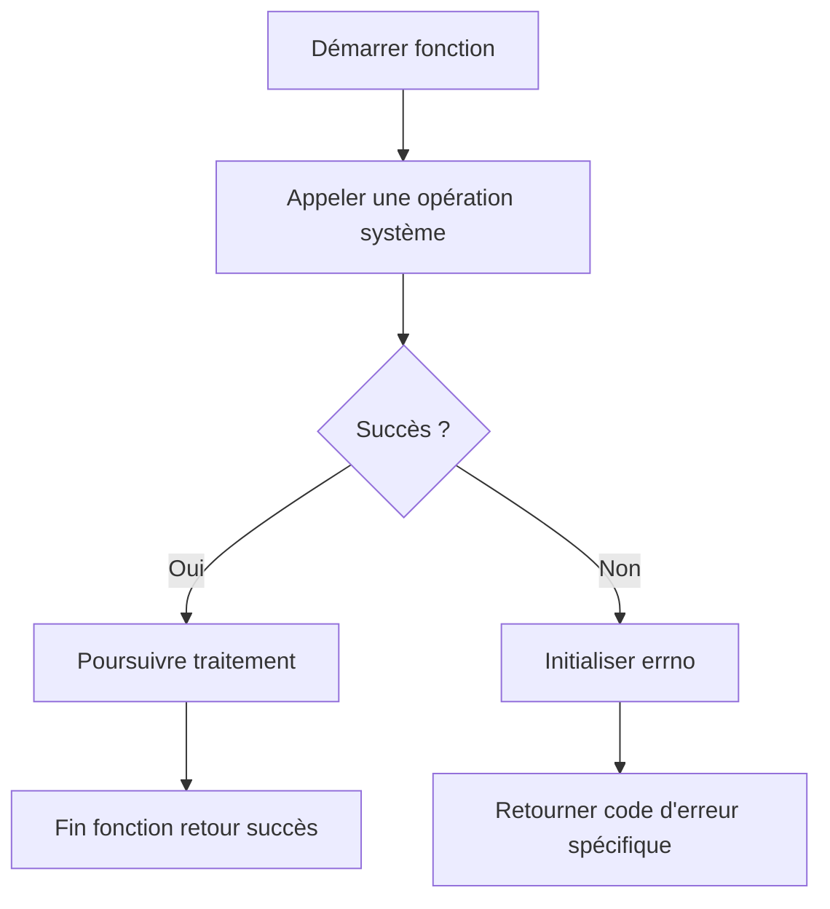

# 8-Séance 8 : Best Practices, Design Patterns et Sécurité  
## 1-Bonnes Pratiques de Programmation C  
### 1-Conventions de nommage, gestion des erreurs (codes de retour, `errno`)  

---

## Introduction  
La qualité et la maintenabilité d'un programme C dépendent de pratiques rigoureuses telles que des conventions de nommage cohérentes et une gestion claire des erreurs. Cette section détaille des méthodes éprouvées permettant d’homogénéiser le code et de traiter les erreurs de manière fiable.

---

## 1. Conventions de nommage  

### 1.1 Objectifs  
- Faciliter la lecture, compréhension et maintenance du code.  
- Éviter les collisions entre symboles.  
- Donner des indices sur le rôle ou type d’une entité.  

### 1.2 Pratiques courantes  

| Élément           | Convention recommandée             | Exemple                        |
|-------------------|----------------------------------|-------------------------------|
| Variables         | noms en minuscules, séparés par `_` (snake_case) | `total_count`, `buffer_size`   |
| Constantes        | majuscules avec `_` (SCREAMING_SNAKE_CASE)       | `MAX_BUFFER_SIZE`, `ERROR_CODE`|
| Fonctions         | noms en minuscules, peuvent utiliser `_`        | `read_data()`, `compute_sum()` |
| Types (struct, enum) | majuscule majuscule initiale + camelCase partiel (Pas toujours uniforme, souvent CamelCase) | `FileContext`, `HttpStatus`    |
| Macros            | majuscules avec `_`                             | `ASSERT`, `MIN`                |

### 1.3 Importance du préfixe  
Pour les bibliothèques, utiliser un préfixe unique évite les conflits (exemple : `mylib_` dans `mylib_init()`).  

---

## 2. Gestion des erreurs  

### 2.1 Codes de retour  

#### a) Principe  
Une fonction indique son succès ou son échec via un entier :  
- 0 souvent pour succès (exemple `main()` ou POSIX).  
- Valeurs négatives ou positives spécifiques indiquent un type d’erreur.

#### b) Exemple classique  

```c
int ouvrir_fichier(const char *nom) {
    FILE *f = fopen(nom, "r");
    if (f == NULL) {
        return -1; // échec
    }
    // ...
    fclose(f);
    return 0; // succès
}
```

#### c) Avantages  
- Simple et standardisé, facile à vérifier.  
- Compatible avec les API POSIX et systèmes Unix.

### 2.2 Utilisation de `errno`  

`errno` est une variable globale définie dans `<errno.h>`, modifiée par les fonctions système en cas d’erreur. Elle permet d’obtenir un code d’erreur précis.

#### a) Principe  

- Après un appel système qui retourne une erreur (souvent `-1`), lire `errno` pour connaître l’erreur.  
- Erreurs standardisées : `EACCES` (permission refusée), `ENOMEM` (mémoire insuffisante), etc.

#### b) Exemple d’utilisation  

```c
#include <stdio.h>
#include <errno.h>
#include <string.h>

void ouvrir_fichier(const char *nom) {
    FILE *f = fopen(nom, "r");
    if (!f) {
        printf("Erreur ouverture fichier : %s\n", strerror(errno));
    } else {
        // ...
        fclose(f);
    }
}
```

### 2.3 Manipulation prudente de `errno`  

- Toujours initialiser `errno = 0` avant un appel sensible.  
- Ne tester `errno` que si la fonction indique un échec (retour négatif ou nul selon le contexte).  

---

## 3. Exemple complet  

```c
#include <stdio.h>
#include <errno.h>
#include <string.h>

#define MYLIB_ERROR_OPEN_FILE -1
#define MYLIB_ERROR_MEMORY   -2
#define MYLIB_SUCCESS          0

int mylib_load_data(const char *filename) {
    errno = 0;
    FILE *file = fopen(filename, "r");
    if (!file) {
        return MYLIB_ERROR_OPEN_FILE;
    }

    // Supposons une opération mémoire ici
    void *buffer = malloc(1024);
    if (!buffer) {
        fclose(file);
        return MYLIB_ERROR_MEMORY;
    }

    // Traitement...
    free(buffer);
    fclose(file);
    return MYLIB_SUCCESS;
}

int main() {
    int status = mylib_load_data("data.txt");
    if (status != MYLIB_SUCCESS) {
        if (status == MYLIB_ERROR_OPEN_FILE) {
            printf("Erreur ouverture fichier : %s\n", strerror(errno));
        } else if (status == MYLIB_ERROR_MEMORY) {
            printf("Erreur allocation mémoire\n");
        }
    } else {
        printf("Chargement réussi\n");
    }
    return 0;
}
```

---

## 4. Diagramme Mermaid : flux de gestion d’erreur  



---

## 5. Sources utilisées  

- [GNU Coding Standards - Naming Conventions](https://www.gnu.org/prep/standards/html_node/Names.html)  
- [The C Programming Language, Kernighan & Ritchie]  
- [Linux errno man pages](https://man7.org/linux/man-pages/man3/errno.3.html)  
- [POSIX Error Numbers](https://pubs.opengroup.org/onlinepubs/9699919799/basedefs/errno.h.html)  
- [Stack Overflow - Naming conventions in C](https://stackoverflow.com/questions/228783/how-do-i-name-my-variables)  
- [Michael Kerrisk, The Linux Programming Interface]  

---

La cohérence des noms et la gestion rigoureuse des erreurs à l’aide de codes de retour et de `errno` renforcent la robustesse et la lisibilité des programmes C, facilitant ainsi leur maintenance et leur évolution.