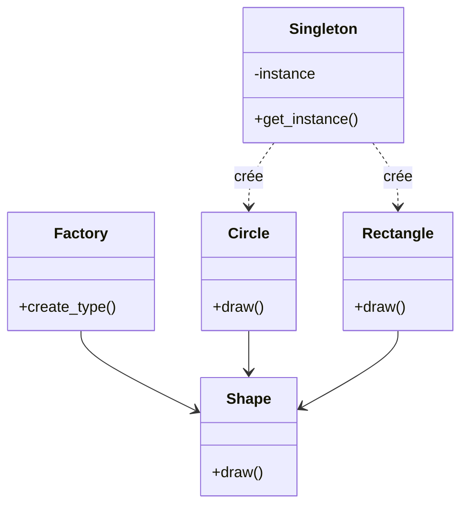

# 8-Séance 8 : Best Practices, Design Patterns et Sécurité  
## 2-Introduction aux Design Patterns en C et Sécurité  
### 1-Singleton et Factory (patterns adaptés au C)  

---

## Introduction  
Les design patterns, largement connus en programmation orientée objet, peuvent être adaptés au langage C, qui est procédural, pour structurer et optimiser le code. Ici, nous abordons deux patterns fondamentaux : **Singleton** et **Factory**, et leur implémentation effective en C.

---

## 1. Le pattern Singleton  

### 1.1 Objectif  
Garantir qu’une seule instance d’une structure de données (souvent des ressources partagées comme une configuration ou un logger) existe pendant tout le cycle de vie du programme.

### 1.2 Implémentation en C  

En C, le Singleton est souvent réalisé à l’aide d’une variable statique dans un fichier source et une fonction d’accès globale.

```c
// logger.h
typedef struct Logger {
    void (*log)(const char *message);
} Logger;

Logger* get_logger(void);
```

```c
// logger.c
#include "logger.h"
#include <stdio.h>

static Logger singleton_logger;

static void log_impl(const char *msg) {
    printf("Log: %s\n", msg);
}

Logger* get_logger(void) {
    static int initialized = 0;
    if (!initialized) {
        singleton_logger.log = log_impl;
        initialized = 1;
    }
    return &singleton_logger;
}
```

### 1.3 Utilisation  

```c
int main() {
    Logger *logger = get_logger();
    logger->log("Démarrage de l'application");
    return 0;
}
```

Cette méthode garantit que `singleton_logger` est unique et accessible globalement.

---

## 2. Le pattern Factory  

### 2.1 Objectif  
Dissocier la création d'objets de leur utilisation, permettant de gérer différentes variantes d’objets sans exposer leur création complexe à l’utilisateur.

### 2.2 Implémentation en C  

On peut utiliser une fonction factory qui retourne des pointeurs sur des structures spécifiques respectant une interface commune.

#### Exemple : Gestion de formes géométriques  

```c
// shape.h
typedef struct Shape {
    void (*draw)(struct Shape *);
} Shape;

Shape* create_circle(void);
Shape* create_rectangle(void);
void shape_draw(Shape *shape);
```

```c
// shape.c
#include "shape.h"
#include <stdio.h>
#include <stdlib.h>

typedef struct {
    Shape base;
    int radius;
} Circle;

typedef struct {
    Shape base;
    int width, height;
} Rectangle;

void circle_draw(Shape *shape) {
    Circle *c = (Circle *)shape;
    printf("Dessiner un cercle de rayon %d\n", c->radius);
}

void rectangle_draw(Shape *shape) {
    Rectangle *r = (Rectangle *)shape;
    printf("Dessiner un rectangle %dx%d\n", r->width, r->height);
}

Shape* create_circle(void) {
    Circle *c = malloc(sizeof(Circle));
    c->base.draw = circle_draw;
    c->radius = 5;  // Exemple
    return (Shape *)c;
}

Shape* create_rectangle(void) {
    Rectangle *r = malloc(sizeof(Rectangle));
    r->base.draw = rectangle_draw;
    r->width = 10; r->height = 20;
    return (Shape *)r;
}

void shape_draw(Shape *shape) {
    shape->draw(shape);
}
```

### 2.3 Utilisation  

```c
int main() {
    Shape *shapes[2];
    shapes[0] = create_circle();
    shapes[1] = create_rectangle();

    for (int i = 0; i < 2; i++) {
        shape_draw(shapes[i]);
        free(shapes[i]);
    }
    return 0;
}
```

---

## 3. Sécurité et gestion de concurrence  

- Dans un contexte multithread, la création Singleton doit être protégée contre les appels concurrents (exemple : `pthread_mutex_lock`).  
- Factory doit garantir qu’aucune ressource partagée critique n’est corrompue lors de la création.  
- Toujours vérifier les retours d’allocation mémoire (`malloc`) pour éviter des dereferencements null.  

---

## 4. Diagramme Mermaid : Structure simplifiée des patterns  



---

## 5. Sources utilisées  

- [Gang of Four Design Patterns](https://en.wikipedia.org/wiki/Design_Patterns) (adaptation principes)  
- [Modern C Design, Andrei Alexandrescu]  
- [Embedded.com - Design patterns in C](https://www.embedded.com/design-patterns-in-c/)  
- [GitHub examples Singleton and Factory in C](https://github.com/topics/c-design-patterns)  
- [Stack Overflow - Implementing Singleton in C](https://stackoverflow.com/questions/1008019/c-singleton-thread-safe)  

---

Le pattern Singleton assure un accès global et unique à une ressource, tandis que le pattern Factory masque la complexité des créations d’objets, améliorant modularité et extensibilité même dans un langage procédural comme C.