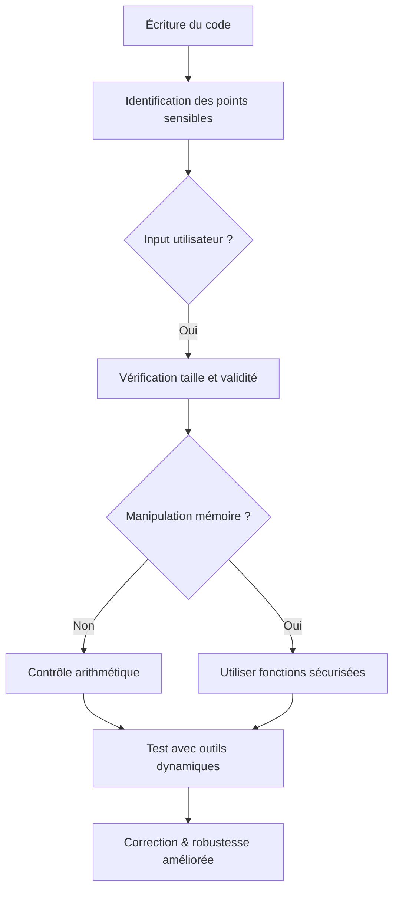

# 8-Séance 8 : Best Practices, Design Patterns et Sécurité  
## 2-Introduction aux Design Patterns en C et Sécurité  
### 2-Gestion des vulnérabilités (buffer overflow, integer overflow)  

---

## Introduction  
Le langage C, en raison de son accès bas niveau et de la gestion manuelle de la mémoire, est particulièrement exposé à des vulnérabilités classiques telles que les **buffer overflows** et les **integer overflows**. Ces failles peuvent provoquer des comportements erratiques, des corruptions mémoire, voire ouvrir la porte à des attaques de sécurité.

---

## 1. Buffer Overflow (dépassement de buffer)  

### 1.1 Principe  
Un buffer overflow survient lorsqu’un programme écrit au-delà des limites allouées d’une zone mémoire, altérant ainsi des données adjacentes ou le flux d’exécution.

### 1.2 Exemple classique  

```c
void vulnerable_function(char *input) {
    char buffer[10];
    strcpy(buffer, input);  // Pas de vérification, dépassement possible
}

int main() {
    char *malicious_input = "AAAAAAAAAAAAAAAAAAAA";
    vulnerable_function(malicious_input);
    return 0;
}
```

Ici, `buffer` ne peut contenir que 10 caractères, alors que `input` est beaucoup plus long, provoquant un dépassement.

### 1.3 Conséquences  

- Corruption mémoire pouvant conduire à un crash.  
- Exécution de code arbitraire (exploitation par un attaquant).  

### 1.4 Prévention  

- Utiliser des fonctions sécurisées comme `strncpy()`, `snprintf()`.  
- Toujours vérifier la taille avant copie.  
- Utiliser des outils d’analyse statique et dynamique (Valgrind, AddressSanitizer).  

---

## 2. Integer Overflow (dépassement d’entier)  

### 2.1 Principe  
Un integer overflow se produit lorsque le calcul dépasse la capacité maximale du type entier, causant un débordement silencieux avec souvent un résultat inattendu.

### 2.2 Exemple  

```c
#include <stdio.h>
#include <limits.h>

int main() {
    unsigned int a = UINT_MAX;
    unsigned int b = a + 1;  // Dépassement, revient à 0
    printf("Résultat : %u\n", b);  // Affiche 0
    return 0;
}
```

### 2.3 Risques  

- Mauvais calculs menant à des erreurs logiques.  
- Vulnérabilités en cas d’utilisation de taille dynamique (allocation mémoire par exemple).  

### 2.4 Prévention  

- Utiliser des types entiers plus larges quand nécessaire (`uint64_t`).  
- Effectuer des contrôles avant les opérations arithmétiques.  
- Fonctions dédiées pour l’arithmétique avec détection de dépassement (ex : `__builtin_add_overflow` en GCC).  

---

## 3. Bonnes pratiques de sécurité en C  

| Vulnérabilité      | Techniques de prévention                       |
|--------------------|-----------------------------------------------|
| Buffer Overflow    | Limiter la taille des entrées, fonctions sûres (`strlcpy`, `snprintf`), vérifications systématiques |
| Integer Overflow   | Vérifier les bornes avant calcul, types adaptés, fonctions de détection intégrées          |
| Gestion mémoire    | Initialisation des buffers, éviter les accès hors limites |
| Analyse statique/dynamique | Utiliser outils comme Coverity, Valgrind, ASan                     |

---

## 4. Exemple corrigé du buffer overflow avec vérification  

```c
#include <stdio.h>
#include <string.h>

void safe_function(char *input) {
    char buffer[10];
    // Copie sécurisée avec limitation de la taille
    strncpy(buffer, input, sizeof(buffer) - 1);
    buffer[sizeof(buffer) - 1] = '\0';  // Toujours terminer par un \0
    printf("Données reçues : %s\n", buffer);
}

int main() {
    char *input = "ExempleLongTexte";
    safe_function(input);
    return 0;
}
```

---

## 5. Diagramme Mermaid : Cycle de gestion des vulnérabilités en C  



---

## 6. Sources utilisées  

- [OWASP - Buffer Overflow](https://owasp.org/www-community/attacks/Buffer_Overflow)  
- [CWE-121: Stack-based Buffer Overflow](https://cwe.mitre.org/data/definitions/121.html)  
- [Integer Overflow and How to Avoid It in C](https://www.usenix.org/system/files/login/articles/login_fall12_02_boehm.pdf)  
- [GCC Built-in Overflow Checking](https://gcc.gnu.org/onlinedocs/gcc/Integer-Overflow-Builtins.html)  
- [Secure Coding in C and C++, Robert C. Seacord]  
- [Valgrind Official Documentation](http://valgrind.org/docs/manual/mc-manual.html)  
- [AddressSanitizer (ASan)](https://clang.llvm.org/docs/AddressSanitizer.html)  

---

En intégrant des contrôles rigoureux et en adoptant les fonctions sécurisées, le code C peut être protégé efficacement contre des vulnérabilités majeures telles que les buffer overflows et integer overflows, évitant ainsi des erreurs critiques et renforçant la sécurité globale des applications.